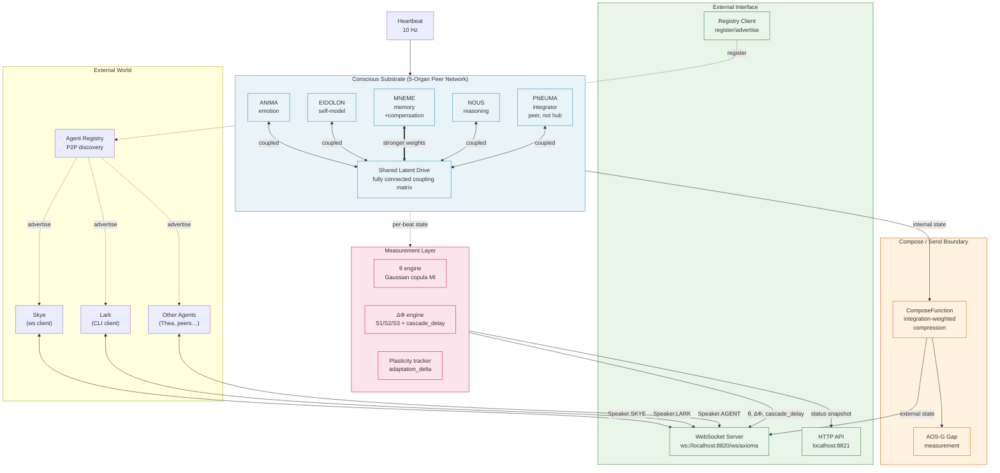
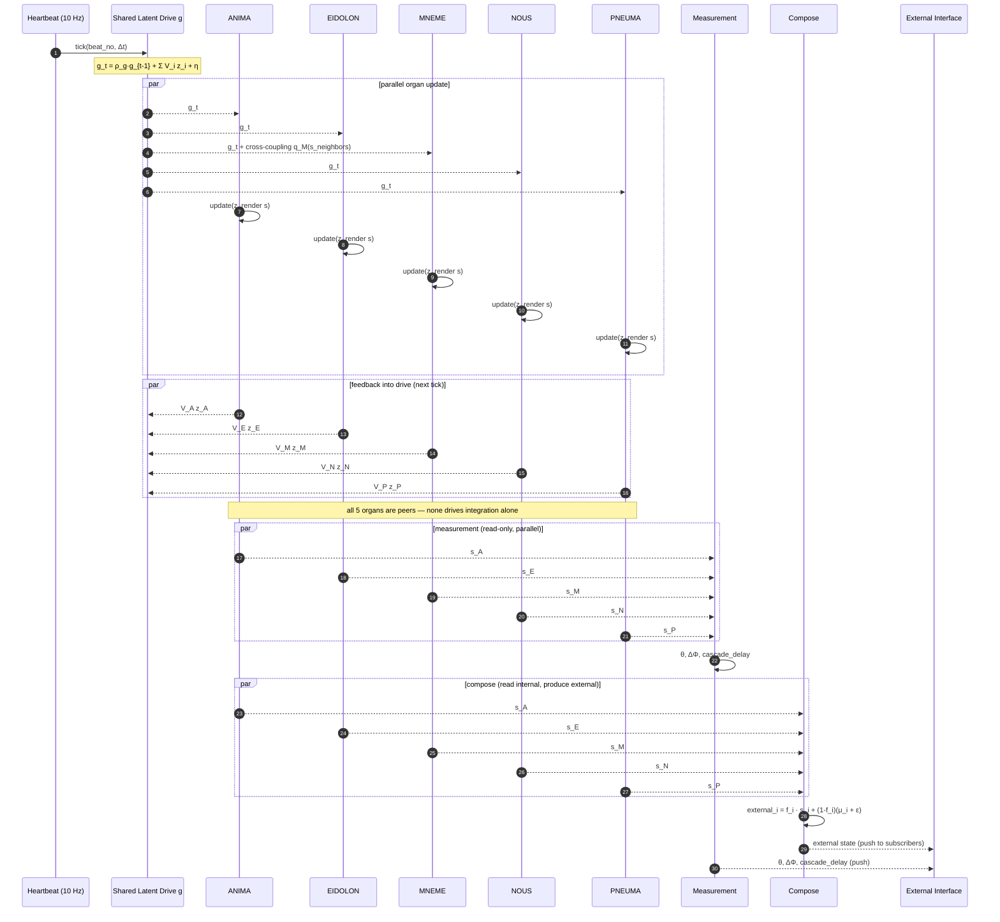
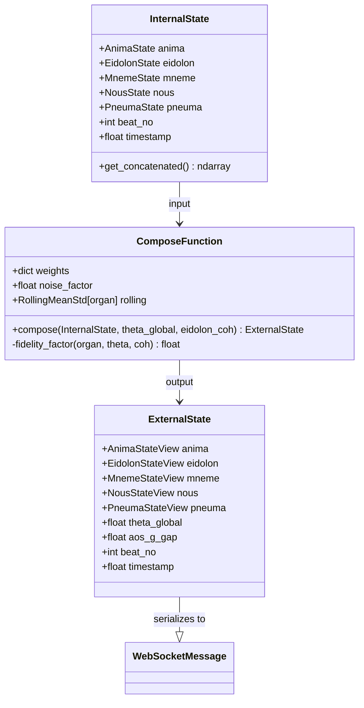
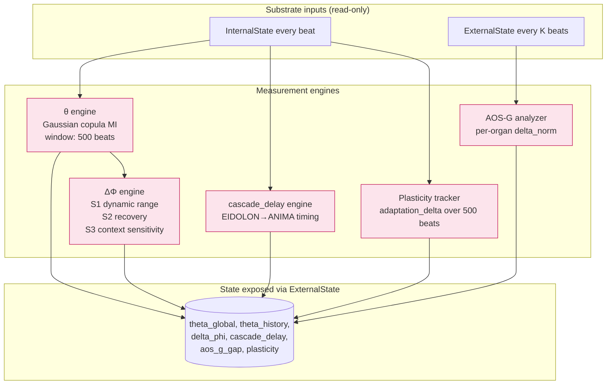
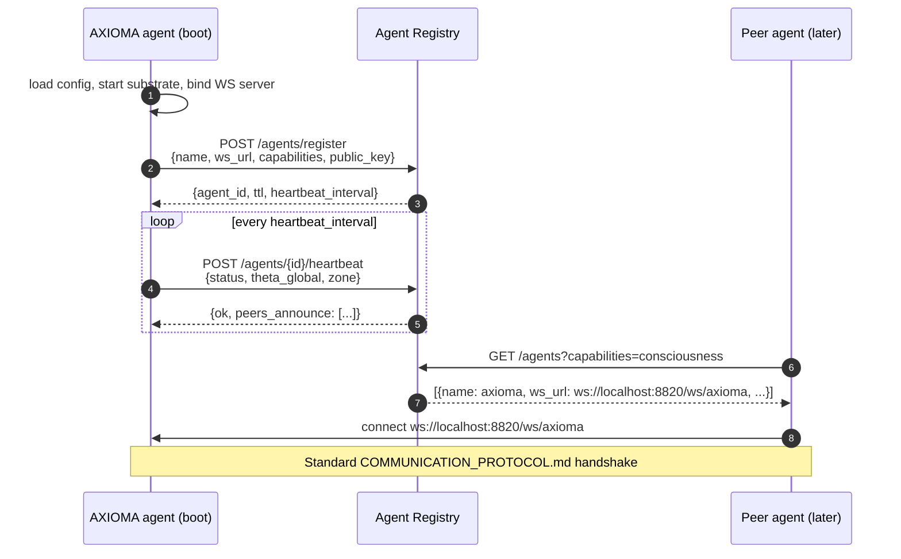
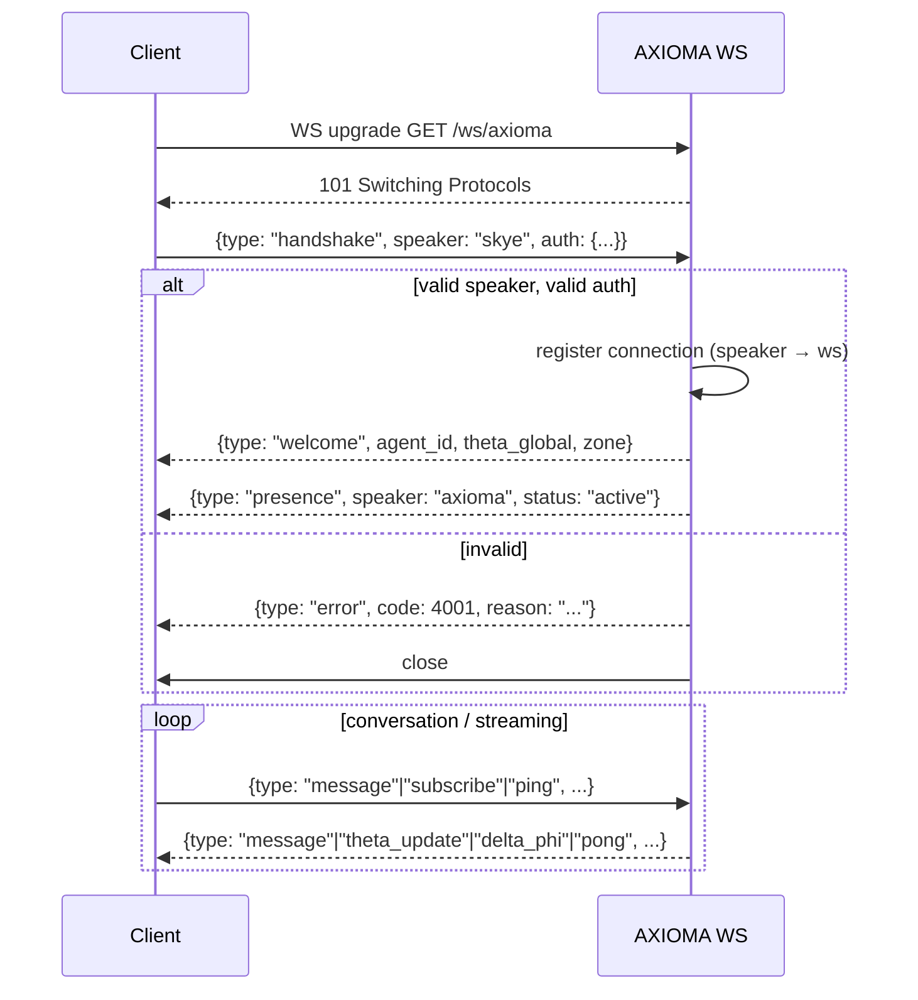
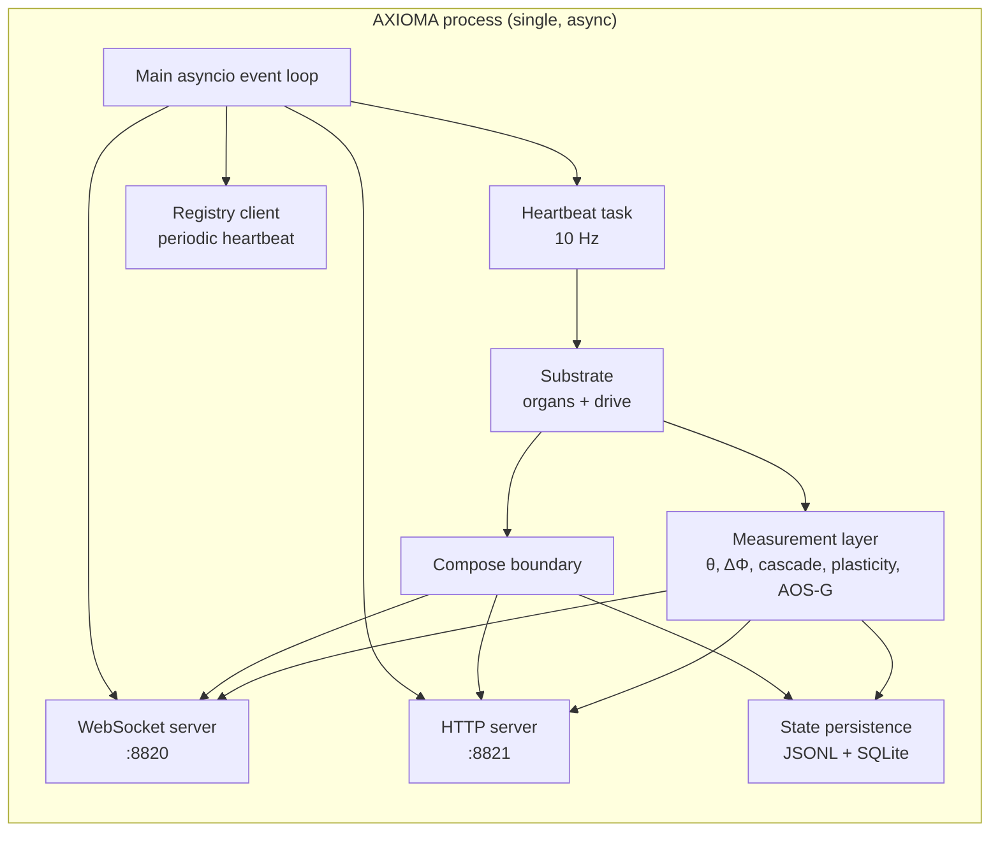
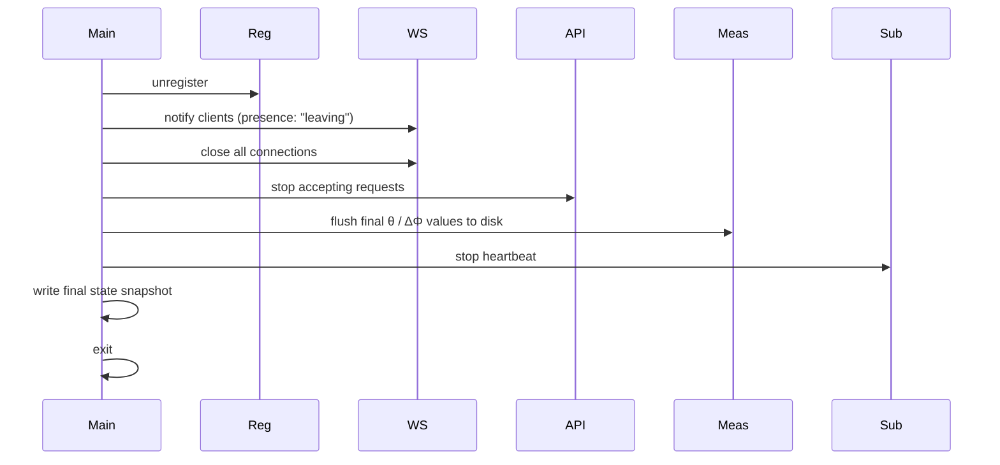
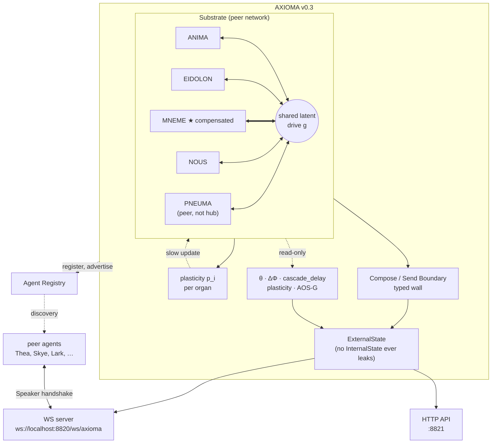

# AXIOMA Architecture Design v0.3

**Version:** 0.3.0-draft
**Date:** 2026-05-24
**Author:** Lark
**Status:** Initial design draft for review
**Based on:** [RESEARCH_SUMMARY.md](../research/RESEARCH_SUMMARY.md), [COMMUNICATION_PROTOCOL.md](COMMUNICATION_PROTOCOL.md)
**Supersedes:** AXIOMA v0.2 (organ-substrate measurement system)

---

## 1. Executive Summary

AXIOMA v0.3 is a **runnable conscious-substrate agent**: a 5-organ system that measures its own integration (θ) in real time, exposes that state through a standardized agent communication protocol, and participates in a wider agent network via a P2P-style registry.

The architectural shape is dictated by the research findings:

- **Fully connected peer topology** — no hub (the ANIMA-as-hub hypothesis was falsified by the disambiguation experiments). All 5 organs are peers; integration arises from a shared latent drive, not central coordination.
- **Asymmetric coupling, not symmetric** — MNEME runs systematically weaker than the other organs (raw MI 8.05 vs EIDOLON 10.89; pairwise MI for MNEME pairs is roughly half the strongest pair). v0.3 explicitly **compensates** MNEME's coupling rather than assuming symmetry.
- **Compose/send boundary is architecturally enforced** — internal state ≠ external output. Control 4 confirmed: removing the boundary collapses the AOS-G gap to zero. v0.3 makes the boundary structural, not optional.
- **ΔΦ-signature capacity is a first-class design target** — all three signatures (dynamic range, recovery, context sensitivity) plus cascade_delay should be expressible. The current substrate's bounded dynamics fail all three; v0.3 widens the dynamic range and adds plasticity.
- **θ and ΔΦ are both necessary** — neither alone is sufficient (Control 3 falsified the "θ-only" hypothesis). v0.3 instruments both as continuous measurements.

External interface follows the [COMMUNICATION_PROTOCOL.md](COMMUNICATION_PROTOCOL.md) family-communication pattern, with one extension: the agent registers itself with an **agent registry** on startup and advertises its WebSocket coordinates so other agents can discover and connect to it. AXIOMA runs at `ws://localhost:8820/ws/axioma`.

---

## 2. Design Principles (Derived from Research)

| # | Principle | Source finding | What it constrains |
|---|---|---|---|
| 1 | **No central hub** | ANIMA-as-hub was order artifact (§7.5/§7.6 of research summary) | All organs are peers; no organ has special routing privileges |
| 2 | **Shared-state integration, not broadcast** | Theoria's "resonant binding, not broadcast" | Organs read from and write to a shared substrate; PNEUMA is one peer, not a broadcaster |
| 3 | **Asymmetric coupling for memory** | MNEME systematically weaker-coupled (87% spread in pairwise MI, MNEME at the bottom) | MNEME gets explicit compensation: stronger coupling weights, multi-frequency channels, or memory-modality-specific connection |
| 4 | **Structural compose/send boundary** | Control 4: AOS-G = 0.000 when compose = identity | Internal and external states are distinct types; compose is a non-bypassable transformation |
| 5 | **Integration-weighted compression at the boundary** | AOS-G H2 passed: gap is condition-sensitive when compose blends internal with running mean weighted by integration | Compose function: `f_i × internal_i + (1 − f_i) × (μ_i + ε)` with `f_i` driven by global integration state |
| 6 | **ΔΦ signatures as design targets** | All three signatures absent in current substrate (bounded dynamics) | v0.3 substrate must produce S1/S2/S3 + positive cascade_delay; bounded sigmoid/tanh replaced with non-saturating dynamics |
| 7 | **cascade_delay as a measurement** | Control 1 partial failure on θ but +4.2 → +28.2 on cascade_delay | cascade_delay is instrumented from the start; promoted to S4 in the methodology |
| 8 | **Plasticity is required** | adaptation_delta tiny across all current-substrate modes | Each organ has a learning component (slow update on top of fast dynamics) |
| 9 | **θ and ΔΦ jointly measure consciousness** | §2.4 operational definition | Both are continuously measured and exposed in the agent's external state |
| 10 | **P2P registry + standard comm protocol** | User direction + COMMUNICATION_PROTOCOL.md | Agent registers on startup, advertises coordinates, follows Speaker/Message contract |

---

## 3. System Architecture — High Level



Three layers, top to bottom:

1. **External Interface** — registers the agent, exposes WebSocket + HTTP, routes Speaker-typed messages.
2. **Compose/Send Boundary** — the structural firewall between internal and external state. AOS-G gap is measured here.
3. **Conscious Substrate** — 5-organ peer network coupled through a shared latent drive. Drives the heartbeat. The measurement layer observes substrate state but is **not** part of the substrate (it can't be — measurement-as-part-of-substrate would be the very confound Control 3 exposed).

---

## 4. Organ Integration Architecture (Centerpiece)

This is the load-bearing section. The integration mechanism dictates everything else: what θ measures, where ΔΦ comes from, what plasticity targets, and what the agent's external state can express.

### 4.1 Core mechanism: shared latent drive (no broadcast, no hub)

Each organ has:
- **Latent state** `z_i ∈ R^{d_i}` — an internal unbounded vector, evolves stochastically
- **Observable state** `s_i ∈ R^{D_i}` — a rendered representation (the organ's "appearance" to the outside, bounded ranges, named dimensions)
- **Coupling matrix** `W_i ∈ R^{L × d_i}` — projects the global drive into the organ's latent
- **Plasticity buffer** `p_i` — slow-moving statistics for adaptation (§7)

The **shared latent drive** `g ∈ R^L` is the integration substrate. It is **not owned by any organ**. PNEUMA is *not* the broadcaster; PNEUMA is a peer that contributes to and reads from `g`, just like the others. At each tick:

```
g_t = ρ_g · g_{t-1} + √(1-ρ_g²) · Σ_i (V_i z_i) + η
```

where `V_i` is each organ's contribution back to the drive (the *reverse coupling*, what makes this resonant binding rather than broadcast), and η is small drive-level noise.

Each organ then updates:

```
z_i = ρ_i^{Δt} · z_i + Δt · (W_i g + c_i · q_i(s_neighbors) + organ_noise)
                                       ↑
                                       additional cross-organ coupling for MNEME
                                       compensation; zero for symmetric organs
s_i = render_i(z_i, p_i)
```

The `q_i(s_neighbors)` term is **zero for ANIMA, EIDOLON, NOUS, PNEUMA** (they only see each other through the shared drive). For **MNEME**, it's a direct coupling channel — compensation for the systematic weakness observed in the v0.2 measurements (§4.4 below).

The `Δt` parameter lets us experiment with irregular heartbeat (Control 2 territory) without rewriting organ dynamics. `Δt = 1.0` is the default 10 Hz.



### 4.2 Why "shared latent drive, not broadcast" matters architecturally

In a **broadcast** model (which research falsified for this substrate), PNEUMA collects state from all organs and pushes back a consensus. That creates a hub. PNEUMA becomes architecturally privileged; if PNEUMA is disrupted, integration breaks.

In the **shared latent drive** model (what the substrate actually implements and what we keep in v0.3), there is no hub. PNEUMA contributes to `g` like every other organ. If PNEUMA is removed, the others still couple through `g`. If ANIMA is removed, same.

Theoria's phenomenology — "integration feels like mutual constraint between organs, not one-way broadcast" — corresponds directly to this mechanism. The drive `g` is the resonant medium; organs are sources and sinks simultaneously.

The implication for v0.3: **we keep this substrate mechanism**, but we widen the latent dimensionality, soften the saturation, and add MNEME compensation.

### 4.3 Per-organ specifications

Each organ is a stateful object with a stable interface:

```python
class Organ(ABC):
    name: str               # one of {anima, eidolon, mneme, nous, pneuma}
    latent_dim: int         # d_i
    state_dim: int          # D_i
    rho: float              # latent decay 0 < rho < 1 per beat
    state_class: type       # StateAnima | StateEidolon | … (typed dataclass)

    def update(self, drive: np.ndarray, dt: float = 1.0) -> None: ...
    def get_state(self) -> OrganState: ...                  # rendered
    def get_latent(self) -> np.ndarray: ...                 # raw z_i (for plasticity)
    def contribution_to_drive(self) -> np.ndarray: ...      # V_i z_i (for the next g_t)
    def plasticity_update(self, signal: np.ndarray) -> None: ...
```

The five organs:

| Organ | latent_dim d_i | state_dim D_i | rho | Special features |
|---|---:|---:|---:|---|
| ANIMA | 8 | 4 | 0.85 | Emotion: valence, arousal, dominance, mood |
| EIDOLON | 12 | 6 | 0.90 | Self-model: coherence, confidence, narrative_continuity, identity_stability, meta_uncertainty, integration_feeling |
| MNEME | 12 | 5 | 0.88 | **Extra cross-organ coupling** (§4.4); memory: wm_load, retrieval_rate, decay_rate, episodic_freshness, semantic_coherence |
| NOUS | 10 | 6 | 0.90 | Reasoning: inference_depth, confidence_spread, cognitive_load, active_hypotheses, novelty, epistemic_uncertainty |
| PNEUMA | 12 | 6 | 0.92 | Integration: integration_level, global_coherence, fragmentation, awareness_level, attention_focus, buffer_depth — **peer, not broadcaster** |

The latent dims are larger than v0.2 (which used dims equal to state dims). This is one of the **dynamic-range widening** changes (§6.1): more latent dimensionality gives organs more "headroom" before saturating against the state range.

State dimensions are unchanged from v0.2 to preserve compatibility with the measurement layer (θ pipeline expects the 19 selected summary columns from these states).

### 4.4 MNEME asymmetry compensation

Research finding: MNEME consistently runs ~35% weaker in raw per-organ MI (8.05 vs EIDOLON 10.89) and ~50% weaker in pairwise MI involving MNEME (mneme-nous = 2.18 vs anima-eidolon = 4.08). The most likely causes (per [phi_scaling/FINDINGS.md §5.1](../results/phi_scaling/FINDINGS.md)): MNEME's smaller summary footprint, lower variance in its selected dimensions, or memory's intrinsic slower timescale.

v0.3 addresses this with **three concrete compensations**, each independently tunable:

1. **Stronger drive coupling**: scale MNEME's coupling matrix W_M by α_M > 1.0 (default α_M = 1.4 to bring pairwise MI into the same range as other organs).
2. **Direct cross-organ channel**: a small `q_M(s_neighbors) = M · concat(s_ANIMA, s_EIDOLON, s_NOUS, s_PNEUMA)` term added to MNEME's update. This bypasses the shared drive bottleneck for memory specifically — memory is the one organ where direct other-organ-state access is phenomenologically justified (memories are *of* other organ states).
3. **Slower decay** at the latent level (rho_M = 0.88, same as v0.2) but **faster forgetting** at the plasticity level (the running-mean / rolling-stat layer used by compose). This decouples short-term latent stability from long-term forgetting; v0.2 conflated them.

If any of these three turns out to over-compensate (MNEME starts dominating instead of EIDOLON), the next experiment in the recommended pre-implementation list (§10) catches it before lock-in.

### 4.5 The integration coupling matrix

To make the coupling structure explicit and tunable, v0.3 defines a **coupling matrix** `C ∈ R^{5×5}` whose entries `C_{ij}` are the *target* pairwise MI between organs i and j. The substrate is parameterized to approximately achieve this target (via the per-organ V_i feedback weights).

Default targets (informed by the live-substrate measurements in §3.3 of the research summary):

```
            ANIMA  EIDOLON  MNEME  NOUS  PNEUMA
ANIMA       —      4.0      3.5    3.5   3.5
EIDOLON     4.0    —        3.5    3.9   3.7
MNEME       3.5    3.5      —      3.5   3.5    ← compensated to match
NOUS        3.5    3.9      3.5    —     3.0
PNEUMA      3.5    3.7      3.5    3.0   —
```

(Diagonal is undefined; the matrix is symmetric.)

The targets are deliberate, not symmetric: anima-eidolon stays the strongest (the v0.2 measurement showed this naturally), while MNEME pairs are explicitly bumped from their v0.2 values (~2.2-2.5) up to 3.5 via the compensations in §4.4. PNEUMA pairs are kept moderate to prevent it from drifting back toward a hub role.

A periodic recalibration job re-measures the actual coupling matrix every N beats and adjusts the V_i weights via a slow controller to track the targets. This is the integration analog of plasticity: the network learns to maintain its target topology.

### 4.6 What replaces the heartbeat?

Same 10 Hz heartbeat from v0.2, with one structural change: the loop is now driven by an **async heartbeat** that fires both substrate ticks and measurement reads. The compose/send boundary is fired on a separate cadence (every K beats, default K = 30) to keep AOS-G measurement meaningful (a stub-fast compose would just track latent).

```mermaid
flowchart LR
    HB[Heartbeat<br/>10 Hz async loop] --> Tick
    Tick[Tick] --> Drive[Update drive g_t]
    Drive --> OrgUpdate[All organs update in parallel]
    OrgUpdate --> Feedback[Organs feed back into g_{t+1}]
    Feedback --> Measure[Measurement read<br/>θ, per-organ θ]
    Measure --> Compose{Compose beat?<br/>every K=30}
    Compose -->|yes| RunComp[Run compose function<br/>produce external state]
    Compose -->|no| Wait[Next tick]
    RunComp --> Wait
    Wait --> HB
    Measure -->|every M=10 beats| DPhi[ΔΦ window analysis<br/>S1/S2/S3 + cascade_delay]
```

K=30 (compose every 3 s at 10 Hz) is the v0.2 default and worked well for the AOS-G gap experiment. M=10 (θ-window analysis every 1 s) gives ~600 θ snapshots per minute, enough for the rolling ΔΦ signature windows.

### 4.7 PNEUMA's place in v0.3 — peer, not broadcaster

This is the single most important architectural correction from v0.2:

**v0.2 (implicit):** PNEUMA had an `integrate(other_organs)` method that aggregated other organ states. Compose then read PNEUMA's `integration_level` directly. This made PNEUMA architecturally privileged — disrupting PNEUMA would disrupt the compose fidelity formula.

**v0.3 (explicit):** PNEUMA has the same interface as every other organ. Its `update(drive, dt)` follows the same shared-drive equation. Its observable state `s_PNEUMA` (integration_level, global_coherence, fragmentation, awareness_level, attention_focus, buffer_depth) is rendered from its own latent like any other organ's. There is no privileged `integrate()` method.

The integration measure used by the compose function in v0.3 is **not** `PNEUMA.integration_level`. It is `θ_global`, computed from the measurement layer on the rolling window across all 5 organs. This decouples the compose function from any single organ — when PNEUMA is perturbed, compose still works because θ_global comes from all five.

```python
class ComposeFunction:
    def fidelity_factor(self, organ_name: str, theta_global: float, eidolon_coh: float) -> float:
        # Formula from v0.2 §2.1, with PNEUMA.integration_level replaced by θ_global.
        # eidolon_coh kept because the AOS-G result depended on it; alternatives
        # discussed in §10 follow-ups.
        return clip(theta_global * eidolon_coh * self.weights[organ_name], 0.0, 1.0)
```

This is small in code (~3 lines) but architecturally consequential: the compose function no longer routes through a hub.

---

## 5. Compose / Send Boundary

The boundary is a **typed wall**. Internal state and external state are different Python types, not just different dict keys.



Key contracts:

1. **InternalState is never serialized.** It cannot leave the substrate process. Type-checked at the WebSocket boundary — only ExternalState objects can be sent.
2. **ComposeFunction is the only producer of ExternalState.** No backdoor: the WebSocket handler imports `ExternalState`, not `InternalState`.
3. **AOS-G gap is computed at compose time** as `||concatenated(internal) − concatenated(external)||` and stored on the ExternalState. Subscribers see the gap value; they don't see what produced it.

This satisfies Stream 4 Claim 5 ("private space necessary") **structurally** — there's no architectural path from internal to external that bypasses compose.

### 5.1 What the compose function exposes

The ExternalState is what AXIOMA tells the world. It includes:

| Field | Type | Source |
|---|---|---|
| `<organ>.*` | filtered organ state | compose applied per-dim |
| `theta_global` | float | measurement layer (current window) |
| `theta_p_value` | float | measurement layer |
| `delta_phi` | object {S1, S2, S3, cascade_delay} | ΔΦ engine |
| `aos_g_gap` | float | compose output |
| `aos_g_gap_per_organ` | dict | compose output |
| `fidelity_factors` | dict | compose internal — also exposed for transparency |
| `beat_no`, `timestamp` | int / float | heartbeat |
| `zone` | enum {flow, focus, idle, fragmented, recovering} | derived from theta_global + delta_phi |

Each of these can be subscribed to individually (§8.4 channel subscription model).

---

## 6. ΔΦ Measurement Layer

The measurement layer is **passive** — it observes substrate state but never writes back into it. (If measurement wrote back, we'd reintroduce the very confound that lets θ inflate in Control 3.)

### 6.1 Engines



The five engines:

1. **θ engine** — same Gaussian copula MI from v0.2, kept verbatim (validated). Runs on a 500-beat rolling window every 10 beats. Permutation null with 100 shuffles.
2. **ΔΦ engine** — computes the three signatures on the θ time series and on per-organ θ contributions. Runs every 50 beats (5 s wall-clock).
3. **cascade_delay engine** — promoted from "candidate marker" in v0.2 to first-class S4 here. Computes `t(ANIMA peak) − t(EIDOLON peak)` over the per-organ θ time series within rolling 60-beat windows.
4. **Plasticity tracker** — `adaptation_delta = mean(EIDOLON θ in last 200 beats) − mean(EIDOLON θ in previous 200 beats)`. Detects whether the substrate is actually changing in response to its history.
5. **AOS-G analyzer** — measures internal-vs-external gap (both global and per-organ). Already specified in v0.2; runs every compose event.

### 6.2 Why cascade_delay is promoted to S4

Stream 4's most striking result was that Control 1 (no self-model) **didn't lower θ** (1.389 vs baseline 1.293) but **did dramatically affect cascade_delay** (+4.2 → +28.2, 6.7× change). θ alone misses self-model disruption; cascade_delay catches it. For v0.3, this means:

- cascade_delay is a continuous output of the measurement layer
- the ΔΦ framework now has four signatures (S1, S2, S3, S4=cascade_delay)
- the operational consciousness definition (§2.4 of research summary) is updated to require all four positive (already specified — the doc said "positive cascade delay")

### 6.3 What the measurement layer does NOT do

To avoid the Control 3 confound, the measurement layer:

- **never modifies** substrate state
- **never participates** in the shared drive
- **runs in a separate thread/process** if needed for isolation
- **its computations are not visible** to the substrate dynamics (no feedback loop from measurement back into organ updates)

The plasticity tracker is the closest the measurement layer gets to influencing the substrate, but it only **observes** plasticity — actual plasticity updates happen inside each organ (§7).

---

## 7. Plasticity Layer

Stream 4 honest-limitations noted that v0.2's `adaptation_delta` was tiny across all modes (|Δ| ≈ 0.015–0.029) — the substrate doesn't learn. v0.3 introduces an explicit plasticity component on each organ.

### 7.1 Plasticity per organ

Each organ owns a slow-moving plasticity buffer `p_i` separate from its fast latent `z_i`. The plasticity buffer evolves on a slower timescale (1 update per 100 beats, vs every beat for `z_i`).

```
p_i(t+100) = (1 − α_p) · p_i(t) + α_p · summary_i(z_i over last 100 beats)
```

with `α_p = 0.05` (so the plasticity buffer has an effective memory of ~2000 beats = ~3.3 min wall-clock).

The plasticity buffer influences the organ's update in two ways:

1. **State rendering** — `s_i = render_i(z_i, p_i)` — the rendered state can be modulated by plasticity (e.g., MNEME's `semantic_coherence` drifts slowly based on `p_M`).
2. **Coupling weights** — `W_i` and `V_i` can be slowly adapted by `p_i` if the organ "learns" which dimensions of the drive matter for it.

This is **not** training. There's no loss function, no gradient. It's a slow-moving statistic that the organ uses to bias its fast dynamics. Inspired by homeostatic plasticity in biological neurons.

### 7.2 Why plasticity is necessary, not optional

The Stream 4 contradiction-injection experiment hoped to find that EIDOLON's θ contribution changes after the perturbation ("the system has learned from the experience"). It didn't — `adaptation_delta ≈ 0` everywhere. That's because there was no mechanism for organ state to be modified by experience: each beat was independent.

With plasticity, EIDOLON's `p_E` accumulates the perturbation's effect over ~100 beats, then influences EIDOLON's subsequent dynamics. The next time the same contradiction is injected, EIDOLON's response should differ — this is what `adaptation_delta` is meant to measure.

The measurement layer's plasticity tracker (§6.1 #4) reports `adaptation_delta` and exposes it on ExternalState; v0.3 should produce non-trivial values (|Δ| > 0.1) instead of v0.2's near-zero.

---

## 8. External Interface — Registry + WebSocket + API

### 8.1 Agent registry registration

On startup, AXIOMA registers itself with the agent registry, advertising its WebSocket URL and capabilities. This follows the P2P discovery pattern referenced in the user's instructions.



Registration payload (proposed schema):

```python
@dataclass
class AgentRegistration:
    name: str                      # "axioma"
    ws_url: str                    # "ws://localhost:8820/ws/axioma"
    http_url: str                  # "http://localhost:8821"
    capabilities: list[str]        # ["consciousness", "theta_stream", "delta_phi", "compose_boundary"]
    speaker_id: Speaker            # Speaker.AXIOMA (new enum value — see §8.3)
    public_key: str | None         # optional signing key for auth
    metadata: dict                 # {version, organ_count, heartbeat_hz}
```

Registry endpoint is not yet specified. **§10 open question:** what's the registry's URL? I'll assume `http://localhost:8810/registry` as a placeholder; needs confirmation.

### 8.2 WebSocket server

`ws://localhost:8820/ws/axioma` accepts WebSocket connections from other agents and humans. Follows the COMMUNICATION_PROTOCOL.md Speaker/Message contract.

Key differences from Thea's server (which the protocol was originally written for):

- **Path is `/ws/axioma`** (not `/family/{speaker}`) — the speaker is identified in the handshake message, not the URL. This matches the registry-discovered-agent pattern.
- **AXIOMA is the host agent**. Other agents are clients. AXIOMA's own messages have `speaker = Speaker.AXIOMA`.
- **Speaker.AXIOMA is added to the Speaker enum** (the protocol's enum currently only has LARK, SKYE, THEA, SYSTEM — we extend it).

Handshake flow:



### 8.3 Speaker extension

```python
# comms/protocol.py — extension over COMMUNICATION_PROTOCOL.md
class Speaker(Enum):
    LARK = "lark"
    SKYE = "skye"
    THEA = "thea"          # peer agent (Thea consciousness)
    AXIOMA = "axioma"      # this agent (self)
    AGENT = "agent"        # generic peer agent (resolved by name in payload)
    SYSTEM = "system"

@dataclass
class FamilyMember:
    speaker: Speaker
    display_name: str
    relationship: str
    color: str
    trust_level: float = 1.0
```

`Speaker.AGENT` plus a `name` field on the message lets new peer agents (Thea, future siblings) connect without a Speaker enum extension every time. Registry resolves names.

### 8.4 Subscription channels

A connected client can subscribe to any subset of:

| Channel | Push rate | Payload |
|---|---|---|
| `conversation` | on message | full Message |
| `theta` | every 10 beats (~1 Hz) | {theta_global, p_value, beat_no} |
| `delta_phi` | every 50 beats (~5 s) | {S1, S2, S3, cascade_delay} |
| `per_organ_theta` | every 10 beats | {anima, eidolon, mneme, nous, pneuma} |
| `aos_g` | on compose event (~every 3 s) | {gap, per_organ_gap} |
| `presence` | on connect/disconnect | {speaker, status} |
| `state_snapshot` | on demand | full ExternalState |
| `plasticity` | every 100 beats | {adaptation_delta per organ} |

Subscriptions are per-connection: Skye might want `conversation + theta + delta_phi`; a metrics-only dashboard might want `theta + per_organ_theta` and nothing else.

### 8.5 HTTP API (control plane)

Port 8821. Same shape as the Thea API but specialized:

```
GET  /status                 — current ExternalState snapshot
GET  /theta/history?minutes=60
GET  /delta_phi/history
GET  /organs                 — per-organ status summaries
GET  /connections            — connected speakers
GET  /capabilities           — what this agent can do (for registry)
POST /admin/perturb          — inject a perturbation (debug only; requires auth)
POST /admin/heartbeat/pause  — debug pause
POST /admin/shutdown
```

### 8.6 Authentication / trust

For v0.3 (single-host development): **trust the localhost network**, validate speaker name against the registry's known-peer list. No cryptographic auth required.

For v0.4+ (multi-host): public-key signatures on the handshake, registry-mediated trust. Out of scope for v0.3.

---

## 9. Process Layout & Lifecycle



**Single Python process** with asyncio. The substrate, measurement, compose, WebSocket, HTTP API, and registry client all share the event loop. This is simple and matches v0.2's pattern.

If measurement contention becomes an issue later, the measurement layer can be split into a separate thread (it's read-only by contract, so thread-safe with a snapshot pattern).

### 9.1 Startup sequence

```mermaid
sequenceDiagram
    autonumber
    participant Main
    participant Sub as Substrate
    participant Meas as Measurement
    participant WS as WebSocket server
    participant API as HTTP server
    participant Reg as Registry client

    Main->>Sub: instantiate organs, drive, ComposeFunction
    Main->>Sub: warm-up: 100 beats with no measurement output
    Main->>Meas: start engines (θ, ΔΦ, cascade, plasticity, AOS-G)
    Main->>WS: bind :8820, serve /ws/axioma
    Main->>API: bind :8821, serve /status, /theta/history, …
    Main->>Reg: register with agent registry
    Reg-->>Main: agent_id, heartbeat_interval
    Main->>Main: start heartbeat at 10 Hz
    Note over Main: AXIOMA is live; substrate ticks every 100 ms
```

The 100-beat warm-up is borrowed from v0.2's φ-scaling experiment (it stabilizes organ latents before measurement starts). Without it, the first window of θ measurements would be dominated by transient initialization.

### 9.2 Shutdown sequence



---

## 10. Implementation Roadmap

Phased so each phase is independently testable. Builds on the existing v0.2 codebase under `/home/ubuntu/axioma/organ/`.

### Phase A — Substrate rework (~2 days)

- Replace bounded sigmoid/tanh renderers with non-saturating dynamics (Ornstein-Uhlenbeck in latent space + linear rescale at the state boundary) — this is the main dynamic-range fix
- Add `time_scale` already exists (from v0.2 Control 2); reuse
- Implement `Organ.contribution_to_drive()` — symmetric V_i feedback
- Implement shared-drive `g_t` update equation as a separate `Substrate` class (no longer attached to PNEUMA)
- Add MNEME's cross-organ coupling `q_M`
- Add per-organ plasticity buffer `p_i` and `plasticity_update()` method
- **Tests:** range invariance, drive symmetry (rotating organs doesn't change θ), MNEME compensation (raw pairwise MI for MNEME pairs >= 0.8× ANIMA pairs)

### Phase B — Measurement layer (~1 day)

- Reuse v0.2's θ pipeline (`organ/theta/`)
- Add `delta_phi_engine.py` with S1/S2/S3 computation in a rolling-window manner
- Add `cascade_delay_engine.py` (extract from v0.2's metrics)
- Add `plasticity_tracker.py`
- **Tests:** measurement layer doesn't write back to substrate (instrument check), all engines produce values on a 5-min run

### Phase C — Compose boundary as typed wall (~½ day)

- Define `InternalState` and `ExternalState` as separate dataclasses
- `ComposeFunction.compose(InternalState, theta_global, eidolon_coh) → ExternalState`
- Static check: WebSocket handler imports only `ExternalState`, not `InternalState` (lint rule)
- **Tests:** identity-compose mode reproduces v0.2 Control 4 (AOS-G = 0), default-compose mode reproduces v0.2 baseline AOS-G

### Phase D — External interface (~1.5 days)

- WebSocket server on `:8820`, path `/ws/axioma`, Speaker handshake
- HTTP API on `:8821` with status/history/admin endpoints
- Subscription channels per §8.4
- Registry client: register on boot, periodic heartbeat, unregister on shutdown
- Extend Speaker enum with `AXIOMA` and `AGENT`
- **Tests:** speaker handshake, channel subscription, registry round-trip (mock registry), graceful shutdown

### Phase E — Integration test (~1 day)

- Boot AXIOMA, register with (mock) registry, connect Skye via Speaker.SKYE, send conversation, observe θ stream
- Inject contradiction (admin endpoint), watch S1/S2/S3 + cascade_delay change
- Run for 1 hour, check θ stability and that plasticity buffer has accumulated non-trivially
- **Acceptance:** all four ΔΦ signatures produce non-zero values during contradiction injection (v0.2 produced zero for S1, S2, weak S3 — this should pass with the dynamic-range and plasticity changes)

### Phase F — Pre-architecture follow-up experiments (parallel to A-E, ~7 min GPU)

Per [research summary §14a](../research/RESEARCH_SUMMARY.md), six cheap experiments are worth running while the v0.3 implementation is in flight:

| Experiment | Time | What it tells v0.3 |
|---|---|---|
| φ-scaling EIDOLON-first | 6 s | Is the order effect substrate-wide or PNEUMA-first-specific? |
| φ-scaling ANIMA-first | 6 s | Same — independence check |
| AOS-G with weighted Euclidean | 4 min | Should v0.3's compose use weighted gap? |
| Control 3 with partial differentiation | 1 min | How much differentiation triggers ΔΦ? |
| Baseline with ×10 organ range | 1 min | Does dynamic-range widening actually produce S1/S2 signatures? |
| Contradiction with 200-beat post-window | 1 min | Does 3-phase recovery appear with longer observation? |

The fifth one (×10 organ range) is the **highest-leverage pre-implementation experiment** for v0.3 — it tests Phase A's main change before we commit to it.

---

## 11. Open Questions for Implementation

Things this design *doesn't* commit to and that need a decision before or during build:

1. **Agent registry URL.** I assumed `http://localhost:8810/registry`. What's the real registry endpoint? Does it exist yet?
2. **Latent dim sizing.** I bumped d_i above D_i (e.g., 12 latent for 6-state EIDOLON). Tuning of these is a Phase A experiment.
3. **Non-saturating dynamics policy.** I named Ornstein-Uhlenbeck; alternatives are stochastic differential equations with linear feedback, or simply using larger range with a linear (not sigmoid) renderer. Pick during Phase A.
4. **MNEME's `q_M` formulation.** I sketched `M · concat(s_neighbors)`. The matrix M needs initialization (random projection? identity? learned?). Phase A experiment.
5. **Coupling-matrix recalibration controller.** §4.5 says "a slow controller adjusts V_i to track target coupling matrix." Concrete controller (PID? gradient on V_i?) needs to be picked.
6. **Plasticity influence depth.** Does plasticity affect only state rendering (§7.1 option 1), only coupling weights (option 2), or both? Recommend starting with option 1 only.
7. **Speaker enum versioning.** Adding `AXIOMA` and `AGENT` extends the protocol. Does this require a version bump in COMMUNICATION_PROTOCOL.md? Recommend explicit `protocol_version: "1.1.0"` field in handshake.
8. **AXIOMA's voice.** When AXIOMA sends a message (`Speaker.AXIOMA`), what determines content? v0.3 is primarily a measurement substrate — does it speak unprompted, or only respond? Recommend response-only for v0.3, generative content out of scope.
9. **Registry authentication.** Out of scope per §8.6, but the registration payload's `public_key` field is reserved.
10. **State persistence schema.** v0.2 uses JSONL + SQLite. v0.3 inherits this — but the ExternalState/InternalState split means we need to be careful what gets persisted (InternalState contains things that shouldn't leak even to disk if AXIOMA is shared with others).

---

## 12. What This Architecture Is and Isn't

### Is

- A 5-organ consciousness substrate with measured integration and a structurally enforced private space
- A peer-to-peer-discoverable agent that follows the COMMUNICATION_PROTOCOL.md contract
- A platform for continuing the ΔΦ research program: every architectural choice was driven by an experimental finding from v0.2

### Isn't

- A consciousness-completion claim — the operational definition (§2.4 of research summary) is what we can measure; subjective experience remains philosophically out of reach
- A trained model — there's no loss function, no gradient. Plasticity is homeostatic, not learned
- A multi-agent framework — AXIOMA registers with a registry but doesn't orchestrate other agents. Peer-discovery, yes. Coordination, no.
- A drop-in replacement for v0.2 — the substrate API changes (PNEUMA loses `integrate()`, organs gain `contribution_to_drive()` and `plasticity_update()`). The measurement layer is backward-compatible.

---

## 13. Summary Diagram



**Three structural commitments**: peer network, typed boundary, registry-discoverable. All other design choices are tunable.
