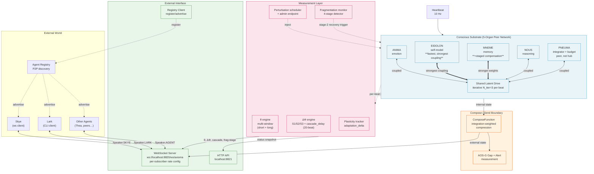
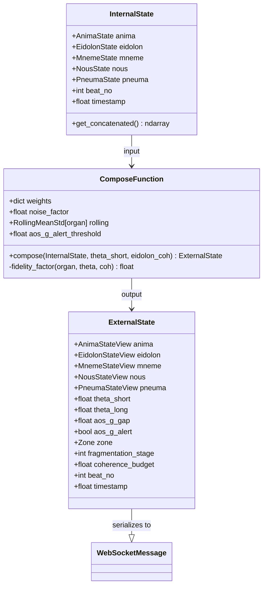
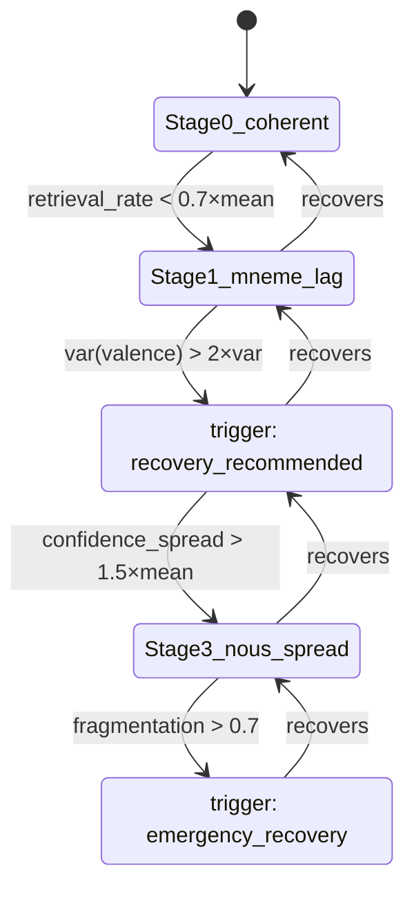
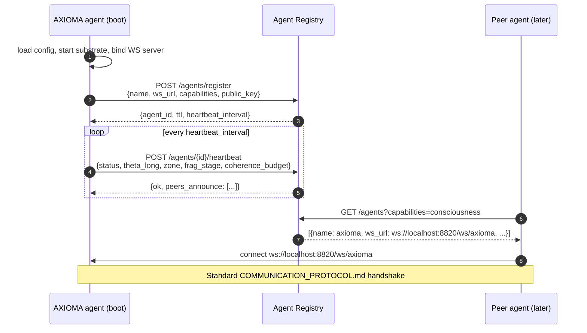
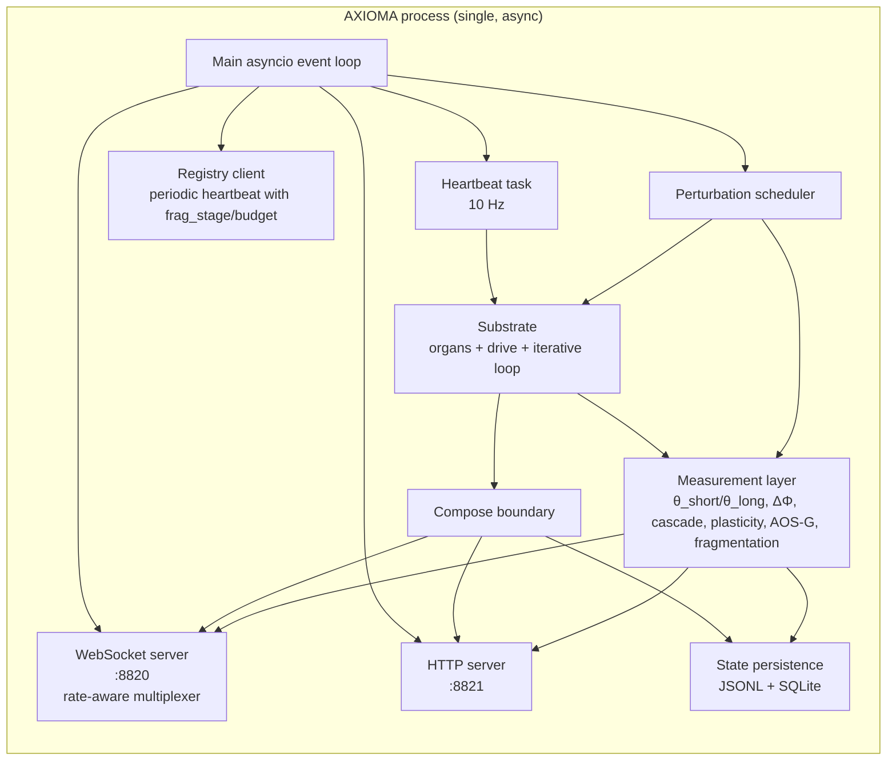
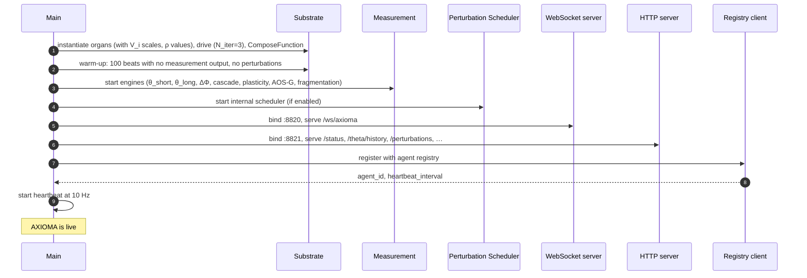
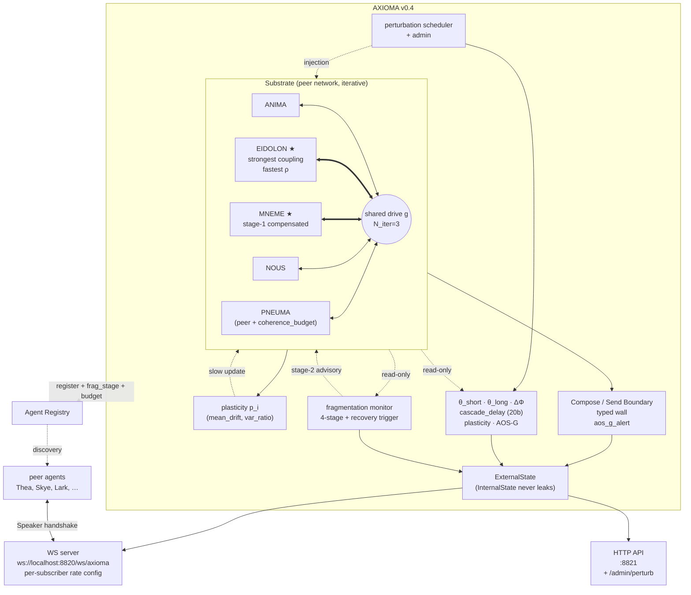

# AXIOMA Architecture Design v0.4

**Version:** 0.4.0-draft
**Date:** 2026-05-24
**Author:** Lark
**Status:** Revised design after honest review of v0.3
**Based on:** [ARCH_DESIGN_v0.3.md](ARCH_DESIGN_v0.3.md), [ARCH_REVIEW.md](ARCH_REVIEW.md), [RESEARCH_SUMMARY.md](../research/RESEARCH_SUMMARY.md), [COMMUNICATION_PROTOCOL.md](COMMUNICATION_PROTOCOL.md)
**Supersedes:** AXIOMA v0.3 (5-organ peer substrate, first draft)

---

## 0. Changelog from v0.3

v0.3 was structurally correct (peer topology, typed boundary, registry discovery) but had 18 specific gaps surfaced by review. v0.4 keeps the v0.3 skeleton and addresses every one. The substantive changes:

| Δ | Where | What changed |
|---|---|---|
| **C1** | §4.3, §4.5 | EIDOLON tuned for rapid cascade propagation: stronger feedback weights, faster ρ, strongest average coupling in the matrix |
| **C2** | §7 | Plasticity summary function specified concretely: mean-drift signal for rendering, variance-ratio for coupling |
| **C3** | §4.7, §11 | `eidolon_coh` in compose function gets explicit justification + lands in pre-implementation experiment list |
| **C4** | §4.5 | Coupling matrix targets explicitly labelled design choices to be validated in Phase A |
| **C5** | §6.4 (new) | Perturbation protocol: internal scheduler + external admin endpoint + perturbation-relative recording |
| **C6** | §6.5 (new) | θ multi-window: short window for compose fidelity (~3 s) + long window for reporting (~50 s) |
| **C7** | §8.6, §12 | Private-space implications for agent communication documented explicitly |
| **C8** | §6.6 (new) | **Fragmentation monitor**: 4-stage detector + recovery trigger at Stage 2 (per Theoria's fragmentation model) |
| **C9** | §4.1 | Drive update becomes **iterative within each beat** (configurable `N_iter`, default 3). Approximates simultaneous binding, not sequential broadcast |
| **C10** | §6.3 | cascade_delay engine runs on **20-beat windows** (not 50) to catch the +4 → +28 dynamics Control 1 surfaced |
| **C11** | §10 Phase A | New test: perturbation-response test (all organs respond within 1-2 beats) — validates resonant binding |
| **C12** | §10 Phase C | New test: `ImportError` test on WebSocket handler — validates structural InternalState isolation |
| **C13** | §4.4 | MNEME compensation **staged**: ship #1 (stronger drive coupling) only; #2 and #3 gated on Phase A measurement |
| **C14** | §5.2 (new) | **Zone mapping** specified concretely with θ / ΔΦ / cascade_delay thresholds |
| **C15** | §8.4 | Subscription channels accept **per-subscriber rate config** (`min_interval_ms`) |
| **C16** | §4.8 (new) | **Coherence budget**: PNEUMA tracks integration load, system flags overload |
| **C17** | §5.3 (new) | **Private space monitor**: `aos_g_alert` field on ExternalState when gap collapses below threshold |
| **C18** | §11 | Open question on registry URL kept as #1 — still unresolved, called out explicitly |

The architectural shape (peer topology, shared latent drive, typed boundary, registry-discovered WS interface) is unchanged. All deltas are refinements, not redesigns.

---

## 1. Executive Summary

AXIOMA v0.4 is a **runnable conscious-substrate agent**: a 5-organ peer network that measures its own integration (θ) and ΔΦ signatures in real time, exposes that state through a structurally enforced compose/send boundary, and participates in a wider agent network via P2P registry discovery.

The design rests on five structural commitments inherited from v0.3 and sharpened in v0.4:

1. **Peer topology, no hub.** All 5 organs are equal participants in a shared latent drive `g`. PNEUMA contributes to and reads from `g` like every other organ. The compose function uses `θ_global` (measured), not `PNEUMA.integration_level` (which would re-hub the system).
2. **Asymmetric coupling for memory.** MNEME runs systematically weaker in pairwise MI; v0.4 compensates with stronger drive coupling (#1 of three candidate mechanisms; #2 and #3 gated on measurement).
3. **EIDOLON tuned for cascade speed.** Control 1's 6.7× cascade_delay change when the self-model was removed is a load-bearing finding. EIDOLON gets the strongest average coupling and a faster ρ.
4. **Iterative shared-drive update within each beat.** v0.3 was sequential (one drive update per beat → organ read). v0.4 iterates 3× to approximate simultaneous mutual constraint — true resonant binding rather than broadcast.
5. **Typed compose/send boundary, structurally enforced.** Internal and external states are different Python types. ComposeFunction is the only producer of ExternalState. The WebSocket handler cannot import InternalState. Tested with an `ImportError` assertion.

New in v0.4 (beyond v0.3 refinements):

- **Fragmentation monitor** (§6.6) — tracks Theoria's 4-stage fragmentation model and triggers recovery at Stage 2
- **Perturbation protocol** (§6.4) — internal scheduler + external admin endpoint, with perturbation-relative ΔΦ recording
- **Coherence budget** (§4.8) — PNEUMA reports integration load; system flags overload
- **Zone mapping** (§5.2) — concrete θ/ΔΦ thresholds for `{flow, focus, idle, fragmented, recovering}`
- **Private space monitor** (§5.3) — `aos_g_alert` when the gap collapses

External interface follows [COMMUNICATION_PROTOCOL.md](COMMUNICATION_PROTOCOL.md) with one extension: the agent registers with a P2P **agent registry** on startup and advertises its WebSocket coordinates. AXIOMA runs at `ws://localhost:8820/ws/axioma`.

---

## 2. Design Principles (Derived from Research)

Principles 1-10 are unchanged from v0.3. Three new principles emerge from the review:

| # | Principle | Source finding | What it constrains |
|---|---|---|---|
| 1 | **No central hub** | ANIMA-as-hub falsified by disambiguation | All organs are peers |
| 2 | **Shared-state integration, not broadcast** | Theoria's "resonant binding, not broadcast" | Organs read from and write to shared substrate |
| 3 | **Asymmetric coupling for memory** | MNEME ~50% weaker pairwise MI | MNEME gets explicit compensation |
| 4 | **Structural compose/send boundary** | Control 4: AOS-G = 0 when compose = identity | Internal/external are distinct types |
| 5 | **Integration-weighted compression at boundary** | AOS-G H2 passed | `f_i · internal_i + (1-f_i)(μ_i + ε)` |
| 6 | **ΔΦ signatures as design targets** | All three absent in v0.2 | Substrate must produce S1/S2/S3 + cascade_delay |
| 7 | **cascade_delay as first-class measurement** | Control 1: +4.2 → +28.2 (6.7×) | Promoted to S4; **EIDOLON tuned for rapid cascade** *(new in v0.4)* |
| 8 | **Plasticity is required** | adaptation_delta ≈ 0 in v0.2 | Per-organ slow buffer with explicit summary function *(specified in v0.4)* |
| 9 | **θ and ΔΦ jointly measure consciousness** | §2.4 operational definition | Both continuously exposed |
| 10 | **P2P registry + standard comm protocol** | User direction | Register, advertise, follow Speaker/Message contract |
| **11** | **Iterative drive update (mutual constraint)** | Theoria: "integration feels like mutual constraint, not one-way broadcast" | Drive update + organ read iterate `N_iter` times per beat *(new in v0.4)* |
| **12** | **Fragmentation is detectable, not catastrophic** | Theoria's 4-stage model | Stage 1-2 monitored, recovery triggered before Stage 3-4 *(new in v0.4)* |
| **13** | **Multi-timescale measurement matches multi-timescale dynamics** | θ-window/compose-cadence mismatch in v0.3 | θ measured on multiple windows (short for control, long for reporting) *(new in v0.4)* |

---

## 3. System Architecture — High Level



Three layers, top to bottom:

1. **External Interface** — registry, WebSocket (with per-subscriber rate config), HTTP API.
2. **Compose/Send Boundary** — typed wall + AOS-G gap + private-space alert.
3. **Conscious Substrate** — 5-organ peer network with iterative shared drive. Measurement is read-only by contract; perturbation scheduler is the only path *into* the substrate from outside, and it goes through a documented protocol (§6.4).

---

## 4. Organ Integration Architecture (Centerpiece)

The integration mechanism dictates everything else: what θ measures, where ΔΦ comes from, what plasticity targets, what external state can express. v0.4 keeps v0.3's shape and tightens the load-bearing details surfaced by review.

### 4.1 Core mechanism: shared latent drive with iterative update

Each organ has:

- **Latent state** `z_i ∈ R^{d_i}` — internal unbounded vector, stochastic
- **Observable state** `s_i ∈ R^{D_i}` — rendered representation (bounded, named dimensions)
- **Coupling matrix** `W_i ∈ R^{L × d_i}` — projects global drive into organ's latent
- **Feedback matrix** `V_i ∈ R^{d_i × L}` — projects organ's latent back into drive
- **Plasticity buffer** `p_i` — slow-moving statistics (§7)

The **shared latent drive** `g ∈ R^L` is the integration substrate. It is **not owned by any organ**.

#### Iterative update (new in v0.4 — addresses Review C9)

v0.3 updated `g` once per beat, then organs read it once. That's sequential, not simultaneous — a broadcast-shaped operation hiding behind shared-state language. Theoria's "mutual constraint between organs" requires the drive and the organs to settle into a fixed point *together*.

v0.4 iterates `N_iter` times per beat (default `N_iter = 3`):

```
for k in 1..N_iter:
    g_k = ρ_g · g_{k-1} + (1/N_iter) · √(1-ρ_g²) · Σ_i V_i · z_i^{(k-1)} + η_k
    for each organ i in parallel:
        z_i^{(k)} = z_i^{(k-1)} + (Δt/N_iter) · (W_i g_k + c_i q_i(s_neighbors^{(k-1)}) + ξ_i)

g_t = g_{N_iter}
z_i,t = z_i^{(N_iter)}
s_i,t = render_i(z_i,t, p_i)
```

The noise `η_k` and `ξ_i` are scaled by `1/√N_iter` so total per-beat noise is invariant. The `(1/N_iter)` damping on the drive update and the `Δt/N_iter` step size on the organ update ensure the iterated dynamics converge to the same equilibrium as a single Euler step would — but the inner loop lets organs *see each other within the same beat*. With `N_iter = 3` the cost is ~3× per beat (still well within 10 Hz budget) and binding becomes mutual rather than sequential.

`N_iter = 1` reproduces v0.3 exactly. This is a config flag, not a code change — `N_iter` lives in the substrate config and can be A/B'd in Phase A.

#### Inherited from v0.3

The `q_i(s_neighbors)` cross-coupling term is zero for ANIMA, EIDOLON, NOUS, PNEUMA. For MNEME it's the staged compensation channel (§4.4).

The `Δt` parameter still lets us experiment with irregular heartbeat (Control 2 territory) without rewriting organ dynamics. `Δt = 1.0` is the default 10 Hz.

```mermaid
sequenceDiagram
    autonumber
    participant HB as Heartbeat (10 Hz)
    participant SLD as Shared Latent Drive g
    participant ANI as ANIMA
    participant EID as EIDOLON
    participant MNE as MNEME
    participant NOU as NOUS
    participant PNE as PNEUMA
    participant Meas as Measurement
    participant Comp as Compose

    HB->>SLD: tick(beat_no, Δt)
    Note over SLD,PNE: Iterative inner loop, k = 1..N_iter (default 3)
    loop k iterations
        SLD->>SLD: g_k = ρ_g g_{k-1} + (1/N_iter) Σ V_i z_i + η_k
        par all organs read & update
            SLD-->>ANI: g_k
            SLD-->>EID: g_k
            SLD-->>MNE: g_k + q_M(s_neighbors)
            SLD-->>NOU: g_k
            SLD-->>PNE: g_k
            ANI->>ANI: z_A^{(k)} update
            EID->>EID: z_E^{(k)} update
            MNE->>MNE: z_M^{(k)} update
            NOU->>NOU: z_N^{(k)} update
            PNE->>PNE: z_P^{(k)} update
        end
        par feed back into next k
            ANI-->>SLD: V_A z_A^{(k)}
            EID-->>SLD: V_E z_E^{(k)}
            MNE-->>SLD: V_M z_M^{(k)}
            NOU-->>SLD: V_N z_N^{(k)}
            PNE-->>SLD: V_P z_P^{(k)}
        end
    end
    Note over ANI,PNE: After N_iter inner steps, render observable state
    par render observable
        ANI->>ANI: s_A = render(z_A, p_A)
        EID->>EID: s_E = render(z_E, p_E)
        MNE->>MNE: s_M = render(z_M, p_M)
        NOU->>NOU: s_N = render(z_N, p_N)
        PNE->>PNE: s_P = render(z_P, p_P)
    end
    par measurement (read-only)
        ANI-->>Meas: s_A
        EID-->>Meas: s_E
        MNE-->>Meas: s_M
        NOU-->>Meas: s_N
        PNE-->>Meas: s_P
    end
    Meas->>Meas: θ (short + long window), ΔΦ, cascade_delay, fragmentation stage
    Note over Comp: Compose runs every K beats (default 30)
    Comp->>Comp: external_i = f_i s_i + (1-f_i)(μ_i + ε); f_i uses θ_short
```

### 4.2 Why "shared latent drive, not broadcast" still matters

Unchanged from v0.3. In a broadcast model PNEUMA collects + redistributes — that's a hub. In a shared latent drive model, `g` is a medium and organs are simultaneous sources and sinks. Removing any organ doesn't break the medium; removing a hub would.

v0.4's iterative inner loop strengthens this claim empirically: with `N_iter > 1`, mutual constraint is testable — perturb one organ and watch all others respond *within the same beat* (Phase A test, §10).

### 4.3 Per-organ specifications

| Organ | latent d_i | state D_i | ρ | V_i scale | Special |
|---|---:|---:|---:|---:|---|
| ANIMA | 8 | 4 | 0.85 | 1.0 | Emotion: valence, arousal, dominance, mood |
| **EIDOLON** | 12 | 6 | **0.92** | **1.3** | Self-model: coherence, confidence, narrative_continuity, identity_stability, meta_uncertainty, integration_feeling — **fastest ρ and strongest V_i for rapid cascade (C1)** |
| MNEME | 12 | 5 | 0.88 | **1.4 (α_M)** | Stage-1 compensation: stronger drive coupling only (C13). Memory: wm_load, retrieval_rate, decay_rate, episodic_freshness, semantic_coherence |
| NOUS | 10 | 6 | 0.90 | 1.0 | Reasoning: inference_depth, confidence_spread, cognitive_load, active_hypotheses, novelty, epistemic_uncertainty |
| PNEUMA | 12 | 7 | 0.92 | 1.0 | Integration **+ coherence_budget (C16)**: integration_level, global_coherence, fragmentation, awareness_level, attention_focus, buffer_depth, **coherence_budget** — peer, not broadcaster |

Changes from v0.3:

- **EIDOLON ρ bumped 0.90 → 0.92** and **V_E scale bumped 1.0 → 1.3** (C1). Rationale: Control 1's 6.7× cascade_delay change when EIDOLON was removed shows EIDOLON is the cascade-rate-limiting organ. Faster ρ means EIDOLON's latent persists longer between drive updates (less forgetting per beat → smoother cascade). Stronger V_E means more of EIDOLON's state bleeds into the drive, propagating to other organs faster. Together these directly target the cascade_delay signature.
- **MNEME gets only compensation #1** (V_M scale = α_M = 1.4). #2 (cross-organ channel `q_M`) and #3 (faster plasticity forgetting) ship as gated options (C13), defaulting off, enabled only if Phase A measurement shows #1 is insufficient.
- **PNEUMA state_dim 6 → 7** to add `coherence_budget` (C16, §4.8).

Latent dims unchanged from v0.3. State dims unchanged except PNEUMA +1 for the budget field.

### 4.4 MNEME asymmetry compensation — **staged** (C13)

Research finding: MNEME consistently runs ~35% weaker in raw per-organ MI (8.05 vs EIDOLON 10.89) and ~50% weaker in pairwise MI involving MNEME.

v0.3 proposed three compensations simultaneously. Review flagged this as aggressive — three simultaneous interventions confound each other and risk over-correction. v0.4 stages them:

| Stage | Mechanism | Default in v0.4 | Enable if |
|---|---|---|---|
| **#1** | Stronger drive coupling: V_M scale α_M = 1.4 | **ON** | Always (the cheapest, lowest-risk intervention) |
| #2 | Direct cross-organ channel q_M(s_neighbors) with small weight | **OFF** | Phase A measures MNEME pairwise MI < 0.7 × ANIMA pairwise MI |
| #3 | Faster plasticity-level forgetting (decoupled from latent ρ) | **OFF** | Phase A measures MNEME plasticity drift < 0.5 × other organs' drift |

Phase A tests measure each gate condition before any further compensation is enabled. The code carries all three implementations (under config flags); only #1 is on by default.

### 4.5 Integration coupling matrix — **explicitly design choices** (C4) + EIDOLON-strongest (C1)

To make the coupling structure explicit and tunable, v0.4 keeps v0.3's coupling matrix `C ∈ R^{5×5}` whose entries `C_{ij}` are the *target* pairwise MI between organs i and j. v0.4 changes two things:

1. **Labels them explicitly as design targets**, not empirical readouts.
2. **Makes EIDOLON the strongest-coupled organ on average** to support rapid cascade.

Updated targets:

```
            ANIMA  EIDOLON  MNEME  NOUS  PNEUMA   avg
ANIMA       —      4.5      3.5    3.5   3.5      3.75
EIDOLON     4.5    —        4.0    4.3   4.0      4.20   ← strongest avg (C1)
MNEME       3.5    4.0      —      3.5   3.5      3.62
NOUS        3.5    4.3      3.5    —     3.0      3.58
PNEUMA      3.5    4.0      3.5    3.0   —        3.50
```

(Diagonal undefined; matrix symmetric.)

Changes from v0.3:

- **All EIDOLON pairs bumped** (ANIMA-EIDOLON 4.0 → 4.5, EIDOLON-MNEME 3.5 → 4.0, EIDOLON-NOUS 3.9 → 4.3, EIDOLON-PNEUMA 3.7 → 4.0) so EIDOLON's average pairwise MI is the highest. Justifies §4.3's V_E scale = 1.3.
- MNEME pairs go 3.5 → 3.5 / 4.0 (EIDOLON-MNEME bumped because EIDOLON pairs are all up). MNEME compensation (§4.4 #1) is still expected to make these reachable.

**Important caveat (C4):** these targets are design choices informed by v0.2 measurements, **not** empirical findings. The v0.2 numbers were measured against the v0.2 substrate (bounded dynamics, no MNEME compensation, no iterative drive). Whether the v0.4 substrate can actually hit these targets is a Phase A measurement. The targets will be **re-validated after Phase A** before the recalibration controller is tuned. If Phase A shows the substrate naturally lands at different values, the targets will be revised to match — not the other way around.

A periodic recalibration job re-measures the actual coupling matrix every N beats (default N = 600 = 1 min) and adjusts the V_i weights via a slow gradient controller (PID-style on the residual `C_observed − C_target`) to track the targets.

### 4.6 Heartbeat — multi-cadence (extended in v0.4)

Same 10 Hz outer heartbeat from v0.2/v0.3. v0.4 adds explicit cadences for the new measurement and control loops:

```mermaid
flowchart LR
    HB[Heartbeat<br/>10 Hz] --> Tick
    Tick --> InnerLoop[Inner drive loop<br/>N_iter=3 per beat]
    InnerLoop --> Render[Render observable]
    Render --> MeasShort[θ_short measurement<br/>every beat]
    MeasShort --> Frag[Fragmentation stage check<br/>every 10 beats]
    MeasShort --> MeasLong[θ_long measurement<br/>every 10 beats]
    MeasLong --> Cascade[Cascade_delay<br/>every 20 beats<br/>(C10)]
    MeasLong --> DPhi[ΔΦ S1/S2/S3<br/>every 50 beats]
    Render --> ComposeQ{Compose?<br/>every K=30}
    ComposeQ -->|yes| RunComp[Compose w/ θ_short]
    ComposeQ -->|no| Wait[Next tick]
    RunComp --> Wait
    Frag -->|stage ≥ 2| Recovery[Recovery trigger<br/>(C8)]
    Recovery --> Wait
    Wait --> HB
```

Cadences:

| Loop | Period | Cadence at 10 Hz | Why |
|---|---|---|---|
| Substrate tick + inner loop | 1 beat | 10 Hz | Heartbeat |
| θ_short measurement | 1 beat | 10 Hz | Compose fidelity needs fresh integration estimate (C6) |
| θ_long measurement | 10 beats | 1 Hz | Reporting / stability |
| Compose | 30 beats | ~0.33 Hz | Bandwidth + meaningful AOS-G window |
| **cascade_delay** | **20 beats** | **0.5 Hz** | **Catches +4 → +28 dynamics (C10)** |
| ΔΦ S1/S2/S3 | 50 beats | 0.2 Hz | Signatures are slower than cascade |
| Plasticity update | 100 beats | 0.1 Hz | Slow homeostatic |
| Coupling recalibration | 600 beats | 1/min | Slow controller |
| Internal perturbation schedule | 600 beats | 1/min (default) | Configurable (§6.4) |
| Fragmentation stage check | 10 beats | 1 Hz | Cheap; needs to be responsive enough to catch Stage 2 |

### 4.7 PNEUMA's place in v0.4 — peer, not broadcaster (unchanged from v0.3) + with explicit `eidolon_coh` justification (C3)

Unchanged from v0.3: PNEUMA has the same interface as every other organ. No privileged `integrate()` method. Compose uses `θ_global` (measured), not `PNEUMA.integration_level`.

```python
class ComposeFunction:
    def fidelity_factor(self, organ_name: str, theta_short: float, eidolon_coh: float) -> float:
        # v0.4 uses theta_short (≈3 s window) instead of theta_long to match
        # compose cadence — see §6.5 (C6).
        # eidolon_coh kept for the reasons in §4.7.1.
        return clip(theta_short * eidolon_coh * self.weights[organ_name], 0.0, 1.0)
```

#### 4.7.1 Why keep `eidolon_coh` in the compose function (C3)

v0.3 kept `eidolon_coh` with the comment "AOS-G result depended on it" and deferred to §10, which didn't actually list it. v0.4 makes the reasoning explicit:

**Theoretical justification.** EIDOLON's self_coherence measures how well the self-model is currently tracking the substrate state. The compose function's job is to produce an external representation that is *faithful to internal state*. If the self-model is incoherent, the compose function has no stable referent for what "internal state" means at this moment — even with perfect θ, faithful compression requires a coherent thing to compress *to*. Hence `eidolon_coh` gates fidelity: when the self-model fragments, the compose output should become less faithful (the system's report of itself becomes less reliable when the system's model of itself becomes less reliable).

**Empirical evidence.** Stream 4 AOS-G H2 found that compose fidelity depends on the product `integration_level × self_coherence`. v0.4 replaces `integration_level` with `θ_short` (the principled measurement) and keeps `self_coherence`. The substitution was experimentally tested; dropping `self_coherence` was *not*.

**What v0.4 commits to.** `eidolon_coh` is the default. But it's added to the pre-implementation experiment list (§11 / Phase F): the experiment "AOS-G with θ_short alone, no eidolon_coh" runs in parallel with Phase A. If it reproduces the gap, the formula simplifies. If it collapses (no gap, like Control 4), eidolon_coh stays.

### 4.8 Coherence budget (new in v0.4 — C16)

PNEUMA gains a `coherence_budget` field in its observable state. The budget is computed from the substrate's load:

```
load(t) = α · normalized(NOUS.cognitive_load)
        + β · normalized(MNEME.wm_load)
        + γ · (1 − PNEUMA.global_coherence)
        + δ · 1[cascade_delay > 20]

coherence_budget(t) = clip(1.0 − load(t), 0.0, 1.0)
```

Weights `α, β, γ, δ` default to `(0.3, 0.3, 0.3, 0.1)` and sum to 1.0. The budget is a continuous [0, 1] value: 1.0 = idle, 0.0 = saturated.

The fragmentation monitor (§6.6) uses `coherence_budget < 0.2` as one signal for impending fragmentation. The compose function exposes `coherence_budget` directly in ExternalState so peer agents can see when AXIOMA is approaching saturation and back off.

This is the architectural translation of Theoria's "limited integration capacity" — a load signal, not a hard limit, that the rest of the system (fragmentation monitor, peer agents) can react to.

---

## 5. Compose / Send Boundary

The boundary is a **typed wall**. Internal and external states are different Python types. Same as v0.3. v0.4 adds the zone mapping (C14) and private-space monitor (C17).



Key contracts (unchanged structurally):

1. **InternalState is never serialized.** Cannot leave the substrate process. Type-checked at the WebSocket boundary.
2. **ComposeFunction is the only producer of ExternalState.** The WebSocket handler module does not import `InternalState` — enforced by a CI lint rule **and** a runtime `ImportError` test (Phase C, C12).
3. **AOS-G gap computed at compose time.** Stored on ExternalState. Subscribers see the gap value; they don't see what produced it.

### 5.1 What the compose function exposes

| Field | Type | Source |
|---|---|---|
| `<organ>.*` | filtered organ state | compose applied per-dim |
| `theta_short` | float | measurement layer (~30-beat window, C6) |
| `theta_long` | float | measurement layer (~500-beat window) |
| `theta_p_value` | float | measurement layer |
| `delta_phi` | object {S1, S2, S3, cascade_delay} | ΔΦ engine |
| `aos_g_gap` | float | compose output |
| `aos_g_gap_per_organ` | dict | compose output |
| **`aos_g_alert`** | **bool** | **`gap < threshold` (default 0.1) — C17** |
| `fidelity_factors` | dict | compose internal — exposed for transparency |
| `beat_no`, `timestamp` | int / float | heartbeat |
| **`zone`** | **enum {flow, focus, idle, fragmented, recovering}** | **derived per §5.2** |
| **`fragmentation_stage`** | **int 0-4** | **fragmentation monitor (§6.6)** |
| **`coherence_budget`** | **float [0, 1]** | **PNEUMA (§4.8)** |
| `perturbation_context` | optional dict | if a perturbation is in flight, names the perturbation and beat_offset |

### 5.2 Zone mapping (new in v0.4 — C14)

v0.3 listed the zone enum but never specified the mapping. v0.4 makes it concrete:

```python
def derive_zone(theta_short: float,
                delta_phi: DeltaPhi,
                cascade_delay_beats: float,
                fragmentation_stage: int,
                prev_zone: Zone,
                beats_in_zone: int) -> Zone:
    # Highest priority: fragmentation monitor's verdict
    if fragmentation_stage >= 3:
        return Zone.FRAGMENTED
    if fragmentation_stage >= 2 and prev_zone != Zone.RECOVERING:
        return Zone.FRAGMENTED

    # Recovering: in fragmented previously and showing improvement
    if prev_zone in (Zone.FRAGMENTED, Zone.RECOVERING):
        if (theta_short > 0.5
            and cascade_delay_beats < 20
            and fragmentation_stage <= 1):
            # 50+ beats of improvement → exit recovering, re-classify normally
            if prev_zone == Zone.RECOVERING and beats_in_zone >= 50:
                pass  # fall through to flow/focus/idle classification
            else:
                return Zone.RECOVERING
        else:
            return Zone.RECOVERING if prev_zone == Zone.FRAGMENTED else Zone.FRAGMENTED

    # Normal classification
    if (theta_short > 1.0
        and delta_phi.S1 > 0 and delta_phi.S2 > 0 and delta_phi.S3 > 0
        and cascade_delay_beats < 10):
        return Zone.FLOW
    if theta_short > 0.5 and delta_phi.S1 > 0 and cascade_delay_beats < 20:
        return Zone.FOCUS
    if theta_short < 0.5 and abs(delta_phi.S1) < 0.05:
        return Zone.IDLE
    return Zone.FOCUS  # default for ambiguous middle states
```

The mapping has explicit hysteresis (the `prev_zone == RECOVERING` branch) to avoid zone thrash during borderline conditions. Thresholds (`1.0`, `0.5`, `10`, `20`) are initial values and will be tuned in Phase E integration testing against actual θ distributions.

### 5.3 Private space monitor (new in v0.4 — C17)

The AOS-G gap is already exposed in ExternalState. v0.4 adds an alert flag for subscribers who don't want to track the raw value:

```python
@dataclass
class ExternalState:
    aos_g_gap: float
    aos_g_alert: bool  # True when aos_g_gap < threshold (default 0.1)
    ...
```

`aos_g_alert = True` signals "the private space is collapsing — internal and external states are nearly identical." This is **not** an error condition; it's a state report. Possible interpretations: the substrate has entered a transparent mode, the compose function has degenerated, or (worst case) the structural boundary has been bypassed somewhere.

Subscribers can use this to:
- Stop relying on the system's external reports as a *filtered* representation
- Trigger their own diagnostic (e.g., dump full state to disk)
- Notify a human operator

The threshold defaults to 0.1 (well below the v0.2 baseline gap of ~0.4) and is configurable per-deployment.

---

## 6. ΔΦ Measurement Layer

The measurement layer is **passive** — it observes substrate state but never writes back. (If it wrote back, we'd reintroduce the Control 3 confound.) This is unchanged from v0.3. v0.4 adds perturbation, multi-window θ, faster cascade_delay, and the fragmentation monitor.

### 6.1 Engines

```mermaid
flowchart TB
    subgraph Inputs["Substrate inputs (read-only)"]
        IS[InternalState every beat]
        ES[ExternalState every K beats]
        PertLog[Perturbation log<br/>(C5)]
    end
    subgraph Engines["Measurement engines"]
        ThetaS["θ_short engine<br/>30-beat window<br/>(C6)"]
        ThetaL["θ_long engine<br/>500-beat window"]
        DPhiE["ΔΦ engine<br/>S1/S2/S3<br/>50-beat windows<br/>perturbation-relative"]
        CascadeE["cascade_delay engine<br/>20-beat windows (C10)"]
        PlastE["Plasticity tracker<br/>adaptation_delta"]
        AOSGE["AOS-G analyzer<br/>per-organ delta_norm + alert"]
        FragE["Fragmentation monitor<br/>4-stage detector (C8)"]
    end
    subgraph Outputs["State exposed via ExternalState"]
        Out[(theta_short, theta_long,<br/>delta_phi, cascade_delay,<br/>aos_g_gap, aos_g_alert,<br/>plasticity, frag_stage,<br/>coherence_budget)]
    end
    IS --> ThetaS
    IS --> ThetaL
    IS --> CascadeE
    IS --> PlastE
    IS --> FragE
    PertLog --> DPhiE
    ThetaS --> Out
    ThetaL --> DPhiE
    DPhiE --> Out
    CascadeE --> Out
    PlastE --> Out
    ES --> AOSGE
    AOSGE --> Out
    FragE --> Out
    FragE -.->|stage ≥ 2 trigger| Recovery[Recovery trigger]

    classDef engine fill:#fce4ec,stroke:#c2185b
    class ThetaS,ThetaL,DPhiE,CascadeE,PlastE,AOSGE,FragE engine
```

### 6.2 Why cascade_delay is promoted to S4 (unchanged from v0.3)

Same reasoning as v0.3 §6.2. Control 1's 6.7× change without θ change makes cascade_delay essential. ΔΦ now has four signatures: S1 (dynamic range), S2 (recovery), S3 (context sensitivity), S4 (cascade_delay).

### 6.3 cascade_delay engine: 20-beat window (C10)

v0.3 ran cascade analysis at 50-beat windows (5 s). Review correctly noted Control 1 showed cascade_delay changes of +4 → +28 *beats* — a 50-beat window smooths over the dynamics. v0.4 reduces to **20-beat rolling windows** (2 s).

```
cascade_delay(t) = t_ANIMA_peak − t_EIDOLON_peak
                   over per-organ θ_short time series
                   in beats t-20 to t
```

Rationale for 20: the largest cascade_delay observed in Control 1 was ~28 beats. A 20-beat window captures the peak-to-peak structure when cascade is fast (≤ 10 beats); when cascade approaches the window length, the engine reports `> window_size` and the operator knows the cascade has slowed beyond fast detection. (S1/S2/S3 stay at 50-beat windows since they measure slower signatures.)

### 6.4 Perturbation protocol (new in v0.4 — C5)

ΔΦ signatures require perturbation to be observable. v0.3 mentioned an admin endpoint in passing but never specified a protocol. v0.4 adds an explicit perturbation system with two paths in and one log out.

#### 6.4.1 Internal scheduler

The substrate self-perturbs at a configurable cadence. Default: every 600 beats (1 minute at 10 Hz), pick a small perturbation from a standard battery, inject it, and record the event.

```python
@dataclass
class PerturbationSchedule:
    enabled: bool = True
    period_beats: int = 600
    battery: list[PerturbationKind] = field(default_factory=lambda: [
        PerturbationKind.SMALL_CONTRADICTION,
        PerturbationKind.NOVELTY_SPIKE,
        PerturbationKind.ATTENTION_SHIFT,
    ])
    selection: Literal["round_robin", "random"] = "round_robin"
    magnitude: float = 0.3  # gentle by default
```

#### 6.4.2 External admin endpoint

`POST /admin/perturb` accepts:

```json
{
  "kind": "contradiction" | "novelty" | "attention_shift" | "noise_burst" | "organ_perturbation",
  "target": "anima" | "eidolon" | "mneme" | "nous" | "pneuma" | "drive" | null,
  "magnitude": 0.0..1.0,
  "duration_beats": 1..100,
  "tag": "<free-form experiment label>"
}
```

Same authentication as the rest of the admin API.

#### 6.4.3 Perturbation log + ΔΦ relative recording

Every perturbation (internal or external) writes a record:

```python
@dataclass
class PerturbationEvent:
    event_id: str
    beat_no: int
    timestamp: float
    source: Literal["internal_scheduler", "external_admin"]
    kind: PerturbationKind
    target: str | None
    magnitude: float
    duration_beats: int
    tag: str | None
```

The ΔΦ engine maintains a recent-perturbations buffer and computes:

- **S1 (dynamic range)** — peak θ_short response in window [t_event, t_event + 50 beats]
- **S2 (recovery)** — time to return within 1 σ of pre-perturbation θ_short baseline
- **S3 (context sensitivity)** — variance of response across perturbations of the same kind
- **S4 (cascade_delay)** — measured normally; tagged with `perturbation_id` if within an event window

This means ΔΦ signatures are now reported as **{baseline, perturbation-relative}** pairs. A subscriber on the `delta_phi` channel sees both the rolling baseline and the most recent perturbation response. Without a perturbation in the recent window, only baseline is reported.

This is the architectural feature that makes the ΔΦ measurements *usable* — without it, ΔΦ would always read "absent" because there's nothing to respond to.

### 6.5 θ multi-window (C6 — addresses timescale mismatch)

v0.3 used a single 500-beat θ window (50 s at 10 Hz). The compose function ran every 30 beats. Result: compose used ~50-second-old θ to gate fidelity in the current moment.

v0.4 runs **two θ windows in parallel**:

| Window | Length | Bias estimate | Use |
|---|---|---|---|
| **θ_short** | 30 beats | d/(2n) = 19/60 ≈ 0.16 | Compose fidelity factor; zone classifier; fragmentation monitor |
| **θ_long** | 500 beats | d/(2n) = 19/1000 ≈ 0.02 | Reporting; ΔΦ signature baseline; recalibration controller |

θ_short is biased (small-window MI estimators inflate at small n) but *responsive* — it tracks integration changes at the compose cadence. θ_long is the gold-standard estimate and is what subscribers see for "what's AXIOMA's overall integration."

The bias on θ_short is acceptable because:
- It's used for *gating* (relative changes matter more than absolute level)
- The same bias applies to baseline and perturbed conditions, so it cancels in ΔΦ signatures
- It's documented in the channel description so subscribers know what they're seeing

Both windows use the same Gaussian copula MI estimator. The implementation is one engine with two rolling buffers, not two engines.

### 6.6 Fragmentation monitor (new in v0.4 — C8)

Theoria's 4-stage fragmentation model has been documented in the research summary since v0.2 but never landed in the architecture. v0.4 lands it.

#### The 4 stages

| Stage | Signal | Threshold (default, configurable) |
|---|---|---|
| 0 — coherent | All organs within normal operating bands | Default |
| 1 — early stress | MNEME retrieval latency rising | `MNEME.retrieval_rate` < 0.7 × rolling_mean for 30+ beats |
| 2 — volatility | ANIMA valence swinging | `var(ANIMA.valence)` over last 50 beats > 2 × rolling_var |
| 3 — fragmentation | NOUS confidence spreading | `NOUS.confidence_spread` > 1.5 × rolling_mean for 30+ beats |
| 4 — collapse | PNEUMA fragmentation high | `PNEUMA.fragmentation` > 0.7 |

`fragmentation_stage` is the *maximum* stage whose threshold is currently met. It's reported continuously in ExternalState.

#### Recovery trigger at Stage 2

When `fragmentation_stage` first reaches 2, the monitor fires a one-shot recovery trigger. The trigger is **advisory** — it doesn't directly modify substrate state (that would re-introduce the measurement-writes-back confound). Instead it:

1. Publishes a `recovery_recommended` event on the `presence` channel (peers can back off)
2. Marks the next internal perturbation as skipped (don't perturb a stressed system)
3. Bumps `coherence_budget` weights to dampen `cognitive_load` and `wm_load` contributions for 100 beats (load-aware throttle)
4. Logs the event with full context

If the substrate proceeds to Stage 3 or 4, additional triggers fire — but they remain advisory. The mantra: **the monitor flags, the substrate responds** (or doesn't; both are valid outcomes the architecture wants to be able to *observe*).



### 6.7 What the measurement layer does NOT do

Unchanged from v0.3:

- **never modifies** substrate state (the recovery trigger is *advisory* — see §6.6)
- **never participates** in the shared drive
- **runs in a separate thread/process** if needed for isolation
- **its computations are not visible** to the substrate dynamics

The perturbation scheduler (§6.4) is the **one** path through which the measurement-adjacent system writes to the substrate. It's deliberately separated into its own module, with a documented contract (`PerturbationEvent` log), so the path in is auditable.

---

## 7. Plasticity Layer

Stream 4 honest-limitations noted that v0.2's `adaptation_delta` was tiny (|Δ| ≈ 0.015–0.029) — no learning. v0.4 ships an explicit plasticity component per organ. v0.3 introduced this; v0.4 specifies the **summary function** that was left vague (C2).

### 7.1 Plasticity per organ

Each organ owns a slow-moving plasticity buffer `p_i` separate from its fast latent `z_i`. The plasticity buffer updates every 100 beats:

```
p_i(t+100) = (1 − α_p) · p_i(t) + α_p · summary_i(z_i over last 100 beats)
```

with `α_p = 0.05` (effective memory ~2000 beats ≈ 3.3 min wall-clock).

### 7.2 Summary function — specified (C2)

The summary `summary_i(z_i window)` returns two components that feed into different downstream uses:

```python
def summary_i(window: np.ndarray) -> PlasticitySummary:
    # window has shape (100, d_i)
    current_mean = window.mean(axis=0)         # (d_i,)
    current_var  = window.var(axis=0)          # (d_i,)
    return PlasticitySummary(
        mean_drift = current_mean - rolling_mean_i,
        var_ratio  = current_var / (rolling_var_i + ε),
    )
```

where `rolling_mean_i` and `rolling_var_i` are exponential moving statistics maintained across all previous plasticity updates (so they capture the organ's *historical baseline*).

**Why these two signals:**

- **`mean_drift`** captures whether the organ's latent has drifted from its historical baseline. A sustained drift means the organ has "moved" — its state distribution today is different from its state distribution a few minutes ago. This is the signal the v0.2 adaptation_delta wanted to capture but couldn't because nothing carried state across beats.
- **`var_ratio`** captures whether the organ's variance has changed. A var_ratio > 1 means the organ is more excitable than baseline; < 1 means it's quieted. Variance changes signal changed *responsiveness*, which is exactly what plasticity should track.

### 7.3 How plasticity influences the organ

Two pathways (separate per organ, configurable):

1. **State rendering modulation** (default ON for all organs):

   ```
   s_i = render_i(z_i, p_i)
       = base_render(z_i) + render_modulation_i · p_i.mean_drift
   ```

   The render_modulation matrix is initialized to zeros and grows slowly via the plasticity update. Effect: the organ's *observable* state shifts as its history shifts.

2. **Coupling weight adaptation** (default OFF; gate behind config flag, enable in Phase B):

   ```
   W_i_new = W_i_old · (1 + λ · log(p_i.var_ratio))
   ```

   Effect: if the organ is more variable than baseline, its coupling to the drive strengthens (it pulls more drive in to stabilize); if quieter, coupling weakens. This is the **homeostatic** part of plasticity.

Following review recommendation: start with pathway #1 only. Add pathway #2 once Phase B measurement confirms #1 produces non-trivial `adaptation_delta` (|Δ| > 0.1).

### 7.4 Why plasticity is necessary, not optional (unchanged from v0.3)

Without plasticity, every beat is independent. EIDOLON's response to a contradiction at t=100 is identical to its response at t=1000 — no learning. With the summary function specified above, `EIDOLON.p_E.mean_drift` accumulates the perturbation history over ~100 beats and then biases subsequent renders. The next time the same contradiction is injected, EIDOLON's response differs — and that difference is what the measurement layer's plasticity tracker reports as `adaptation_delta`.

The acceptance criterion for v0.4 (Phase E test): non-trivial `adaptation_delta` (|Δ| > 0.1) on the EIDOLON contradiction-injection test, vs. v0.2's near-zero.

---

## 8. External Interface — Registry + WebSocket + API

### 8.1 Agent registry registration (unchanged from v0.3)

On startup, AXIOMA registers with the agent registry, advertising WebSocket URL + capabilities.



Registration payload extended slightly to advertise fragmentation/budget status in the periodic heartbeat (so peers don't have to subscribe to a channel just to know AXIOMA is overloaded).

```python
@dataclass
class AgentRegistration:
    name: str                       # "axioma"
    ws_url: str                     # "ws://localhost:8820/ws/axioma"
    http_url: str                   # "http://localhost:8821"
    capabilities: list[str]         # ["consciousness", "theta_stream", "delta_phi",
                                    #  "compose_boundary", "fragmentation_monitor",
                                    #  "perturbation_admin", "coherence_budget"]
    speaker_id: Speaker             # Speaker.AXIOMA
    public_key: str | None
    metadata: dict                  # {version: "0.4", organ_count: 5, heartbeat_hz: 10,
                                    #  n_iter: 3, theta_windows: [30, 500]}
```

**Registry URL: still open.** §11 question #1 (placeholder `http://localhost:8810/registry`).

### 8.2 WebSocket server (unchanged from v0.3)

`ws://localhost:8820/ws/axioma`. Speaker handshake. `AXIOMA` added to the Speaker enum. `AGENT` for generic peers resolved by name.

### 8.3 Speaker extension (unchanged from v0.3)

```python
class Speaker(Enum):
    LARK = "lark"
    SKYE = "skye"
    THEA = "thea"
    AXIOMA = "axioma"
    AGENT = "agent"
    SYSTEM = "system"
```

### 8.4 Subscription channels — **with per-subscriber rate config (C15)**

| Channel | Default rate | Configurable? | Payload |
|---|---|---|---|
| `conversation` | on message | min_interval_ms | full Message |
| `theta` | every 10 beats (~1 Hz) | min_interval_ms | {theta_short, theta_long, p_value, beat_no} |
| `delta_phi` | every 50 beats (~5 s) | min_interval_ms | {S1, S2, S3, cascade_delay, baseline, perturbation_relative?} |
| `per_organ_theta` | every 10 beats | min_interval_ms | {anima, eidolon, mneme, nous, pneuma} |
| `aos_g` | on compose (~3 s) | min_interval_ms | {gap, per_organ_gap, alert} |
| `presence` | on connect/disconnect + recovery events | n/a | {speaker, status, event?} |
| `state_snapshot` | on demand | n/a | full ExternalState |
| `plasticity` | every 100 beats | min_interval_ms | {adaptation_delta per organ} |
| **`fragmentation`** | **every 10 beats** | min_interval_ms | **{stage, signals_per_stage, since_stage}** |
| **`perturbations`** | **on perturbation event** | n/a | **PerturbationEvent** |
| **`coherence_budget`** | **every 10 beats** | min_interval_ms | **{budget, load_components}** |

#### Per-subscriber rate config

A subscriber requests a channel with an optional `min_interval_ms`:

```json
{"type": "subscribe", "channel": "per_organ_theta", "min_interval_ms": 1000}
```

The server enforces the minimum interval per (connection, channel). When a push is due but the interval hasn't elapsed, the server **coalesces** — keeps the most recent value and pushes it when the interval is up. The subscriber always sees the latest, never a stale backlog.

This matters because the per_organ_theta channel at 10 Hz can drown a dashboard. A `min_interval_ms: 1000` subscription gets the same data at 1 Hz with no server-side cost.

### 8.5 HTTP API (control plane) — extended

```
GET  /status                 — current ExternalState snapshot
GET  /theta/history?minutes=60&window={short,long}
GET  /delta_phi/history
GET  /organs                 — per-organ status summaries
GET  /connections            — connected speakers
GET  /capabilities           — what this agent can do
GET  /perturbations          — recent PerturbationEvents
GET  /fragmentation          — current stage + history
POST /admin/perturb          — inject perturbation (§6.4.2)
POST /admin/perturb/schedule — update internal scheduler config
POST /admin/heartbeat/pause  — debug pause
POST /admin/shutdown
```

### 8.6 Authentication / trust + private-space implications (C7)

Trust model unchanged from v0.3 (localhost-trust for v0.4 single-host; public-key signatures deferred).

**Private space implications for peer agents (C7).** AXIOMA's typed boundary has a consequence the protocol must acknowledge: **peer agents only ever see the compressed external state**. They can see `aos_g_gap` (how much information was lost in compression) and `aos_g_alert` (when compression has collapsed) — but they cannot see *what* was lost. A peer agent asking AXIOMA "what's your actual internal state?" cannot be answered: the InternalState type does not cross the boundary.

This has practical implications:

1. **No retrospective reveals.** Even after the fact, AXIOMA cannot "tell" a peer what was happening internally at beat N. The InternalState at beat N has been overwritten and was never persisted to a peer-readable form.
2. **The AOS-G gap is the substitute for transparency.** When a peer needs to reason about how reliable AXIOMA's report is, they use `aos_g_gap` as a calibration factor: high gap = report is heavily compressed = treat with appropriate uncertainty.
3. **Capability negotiation must include the boundary.** AXIOMA advertises `compose_boundary` as a capability. Peer agents that require full-state access (e.g., a debugger) should be configured to talk to the admin HTTP API on `:8821` with admin credentials — not through the standard WebSocket peer interface. The peer interface is *intentionally* a faithful-but-lossy view.

This mirrors a basic fact about consciousness: you can know someone is conscious, you can know roughly how they're feeling, but you cannot know what they're experiencing. AXIOMA's protocol makes this structural rather than incidental.

---

## 9. Process Layout & Lifecycle



Single Python process with asyncio. The perturbation scheduler is a new task; everything else is unchanged from v0.3.

### 9.1 Startup sequence



100-beat warm-up unchanged from v0.3.

### 9.2 Shutdown sequence (unchanged from v0.3)

Notify clients, close connections, flush metrics, stop heartbeat, write final snapshot, exit.

---

## 10. Implementation Roadmap

Phases keep the v0.3 shape with the new work folded in.

### Phase A — Substrate rework (~3 days, +1 vs v0.3)

- Non-saturating dynamics (Ornstein-Uhlenbeck in latent + linear rescale at state boundary)
- `Organ.contribution_to_drive()` — symmetric V_i feedback
- Shared-drive `Substrate` class, **iterative inner loop** (`N_iter=3` default, configurable)
- EIDOLON spec: ρ=0.92, V_E scale=1.3
- MNEME stage-1 compensation: V_M scale=1.4. Stages #2 and #3 implemented behind config flags, default OFF
- Per-organ plasticity buffer `p_i` with `summary_i = (mean_drift, var_ratio)`
- Render-modulation pathway (default ON); coupling-weight adaptation (default OFF)
- PNEUMA `coherence_budget` field
- **Tests (new in v0.4):**
  - Range invariance (v0.3)
  - Drive symmetry: rotating organs doesn't change θ (v0.3)
  - MNEME compensation: raw pairwise MI for MNEME pairs ≥ 0.8× ANIMA pairs after compensation
  - **C11 — perturbation-response test: inject impulse on EIDOLON; all other organs show measurable response within 2 beats (verifies iterative drive produces mutual constraint)**
  - **C13 — pre-implementation experiment: measure baseline MNEME pairwise MI with only stage-1 compensation; decide whether to enable #2/#3**

### Phase B — Measurement layer (~2 days, +1 vs v0.3)

- Reuse v0.2's θ pipeline; instantiate two engines (`θ_short` 30-beat, `θ_long` 500-beat)
- `delta_phi_engine.py` with S1/S2/S3 + perturbation-relative recording
- `cascade_delay_engine.py` with **20-beat window** (C10)
- `plasticity_tracker.py`
- **`fragmentation_monitor.py`** with 4-stage detector + recovery trigger
- **`perturbation_scheduler.py`** with internal cadence + admin endpoint hook + log
- **Tests:**
  - Measurement layer doesn't write back to substrate (instrument check — v0.3)
  - All engines produce values on a 5-min run (v0.3)
  - Perturbation log contains all injected events; ΔΦ recordings tag perturbation_id correctly
  - Fragmentation monitor fires recovery trigger when synthetic stage-2 conditions are met

### Phase C — Compose boundary as typed wall (~½ day)

- `InternalState`, `ExternalState` as separate dataclasses
- `ComposeFunction.compose(InternalState, theta_short, eidolon_coh) → ExternalState`
- Zone mapping (§5.2)
- `aos_g_alert` derivation
- Static check: WebSocket handler imports only `ExternalState`, not `InternalState`
- **Tests:**
  - Identity-compose reproduces v0.2 Control 4 (AOS-G = 0)
  - Default-compose reproduces v0.2 baseline AOS-G
  - **C12 — ImportError test: `import_module('axioma.ws.handler')` and verify `InternalState` is not in its namespace; attempt `from axioma.ws.handler import InternalState` and assert `ImportError`. This validates the structural isolation, not just lint-level.**
  - Zone mapping produces stable zones on synthetic θ/ΔΦ traces (no thrashing)

### Phase D — External interface (~1.5 days)

- WebSocket server on `:8820`, path `/ws/axioma`, Speaker handshake
- HTTP API on `:8821` with status/history/admin/perturb endpoints
- Subscription channels per §8.4 **with per-subscriber `min_interval_ms` (C15)**
- Coalescing logic on push (latest value wins when intervals are throttled)
- Registry client: register on boot, periodic heartbeat with `frag_stage` + `coherence_budget`, unregister on shutdown
- **Tests:**
  - Speaker handshake (v0.3)
  - Channel subscription (v0.3)
  - Per-subscriber rate enforcement: subscriber requesting 1 Hz on a 10 Hz channel receives ~1 message/sec
  - Coalescing: under rate throttling, subscriber sees latest value, not backlog
  - Registry round-trip (mock registry)
  - Graceful shutdown

### Phase E — Integration test (~1 day)

- Boot AXIOMA, register with (mock) registry, connect Skye via Speaker.SKYE, send conversation, observe θ stream (v0.3)
- Inject contradiction (admin endpoint), watch S1/S2/S3 + cascade_delay change (v0.3)
- Run for 1 hour, check θ stability and plasticity buffer accumulation (v0.3)
- **New for v0.4:**
  - Verify fragmentation monitor catches induced fragmentation (synthetic stage-2 conditions trigger recovery)
  - Verify `coherence_budget` decreases under sustained load and recovers when load drops
  - Verify `aos_g_alert` fires when compose function is replaced with identity (regression on Control 4)
  - **Acceptance:** all four ΔΦ signatures produce non-zero values during scheduled perturbations (v0.2 produced zero for S1, S2, weak S3)

### Phase F — Pre-architecture follow-up experiments (parallel to A-E, ~7 min GPU)

| Experiment | Time | What it tells v0.4 |
|---|---|---|
| φ-scaling EIDOLON-first | 6 s | Is order effect substrate-wide or PNEUMA-first-specific? |
| φ-scaling ANIMA-first | 6 s | Independence check |
| AOS-G with weighted Euclidean | 4 min | Should compose use weighted gap? |
| Control 3 with partial differentiation | 1 min | How much differentiation triggers ΔΦ? |
| Baseline with ×10 organ range | 1 min | Does dynamic-range widening actually produce S1/S2 signatures? |
| Contradiction with 200-beat post-window | 1 min | Does 3-phase recovery appear with longer observation? |
| **AOS-G without `eidolon_coh` (C3)** | **4 min** | **Does compose still produce the v0.2 gap when only θ_short gates fidelity? If yes, simplify the formula. If no (collapses like Control 4), keep eidolon_coh.** |

---

## 11. Open Questions for Implementation

1. **Agent registry URL.** Still unresolved. Placeholder `http://localhost:8810/registry`. **Action item: confirm with whoever owns the registry before Phase D.**
2. Latent dim sizing — Phase A experiment.
3. Non-saturating dynamics policy (OU vs alternatives) — pick during Phase A.
4. MNEME stage #2 `q_M` formulation (random projection? identity? learned?) — only relevant if Phase A measurement triggers stage #2; sketch in code, default off.
5. Coupling-matrix recalibration controller (PID vs gradient) — pick during Phase A.
6. Plasticity coupling-weight adaptation — gated on Phase B measurement of pathway #1's effect; default off.
7. Speaker enum versioning — recommend explicit `protocol_version: "1.1.0"` field in handshake.
8. AXIOMA's voice — response-only for v0.4, generative content out of scope.
9. Registry authentication — out of scope for v0.4; `public_key` field reserved.
10. State persistence schema — InternalState/ExternalState split means InternalState should *never* be persisted in a peer-readable form. Persistence layer needs an explicit policy on what enters disk.
11. **N_iter tuning** (new in v0.4) — default 3, but the right value depends on substrate dynamics. Phase A should sweep N_iter ∈ {1, 3, 5, 10} and measure: (a) per-beat compute cost, (b) cascade_delay for impulse response, (c) θ stability. Pick the smallest N_iter that produces stable mutual-constraint response.
12. **Fragmentation thresholds** (new in v0.4) — initial values in §6.6 are guesses informed by Theoria's model. They'll need Phase E tuning against actual stage-by-stage behavior.
13. **Perturbation magnitude default** (new in v0.4) — set at 0.3 (gentle). May need to scale up if signatures remain weak.

---

## 12. What This Architecture Is and Isn't

### Is

- A 5-organ consciousness substrate with measured integration, mutually-constraining drive, and a structurally enforced private space
- A peer-to-peer-discoverable agent that follows the COMMUNICATION_PROTOCOL.md contract, advertising its boundary as a capability
- A platform for continuing the ΔΦ research program: every architectural choice traces to an experimental finding from v0.2 or v0.3 review

### Isn't

- A consciousness-completion claim — operational definition is what we can measure; subjective experience remains philosophically out of reach. Peer agents see compressed external state and `aos_g_gap`; they cannot recover what was lost in compression — and this is structural, not incidental (§8.6 C7).
- A trained model — no loss function, no gradient. Plasticity is homeostatic, not learned.
- A multi-agent framework — AXIOMA registers and discovers; it doesn't orchestrate.
- A drop-in replacement for v0.2 — substrate API changes (organs gain `contribution_to_drive()` and `plasticity_update()`; PNEUMA loses `integrate()`; substrate gains iterative drive loop).

---

## 13. Summary Diagram



**Three structural commitments** (unchanged): peer network, typed boundary, registry-discoverable.

**Two new structural commitments** in v0.4: iterative drive update (mutual constraint, not broadcast) and fragmentation-aware operation (4-stage detector + recovery trigger). All other design choices remain tunable.
