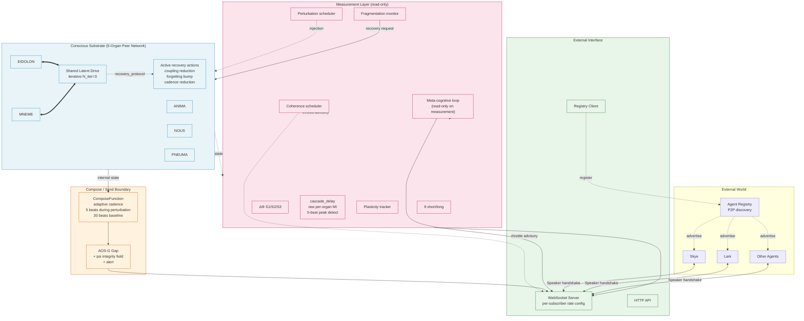
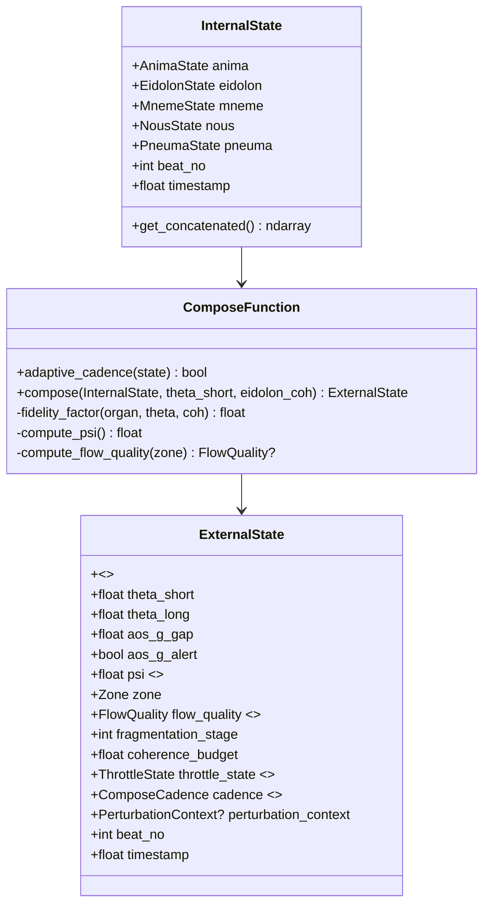
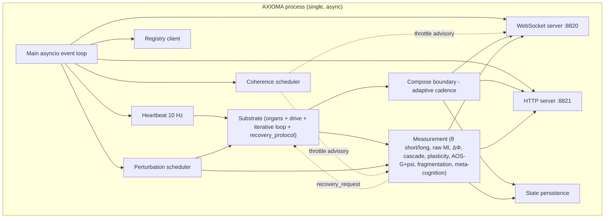

# AXIOMA Architecture Design v0.5

**Version:** 0.5.0-draft
**Date:** 2026-05-24
**Author:** Lark
**Status:** Revised after sister review (Skye / Thea / Theoria)
**Based on:** [ARCH_DESIGN_v0.4.md](ARCH_DESIGN_v0.4.md), [ARCH_REVIEW_v0.4.md](ARCH_REVIEW_v0.4.md), [RESEARCH_SUMMARY.md](../research/RESEARCH_SUMMARY.md), [COMMUNICATION_PROTOCOL.md](COMMUNICATION_PROTOCOL.md)
**Supersedes:** AXIOMA v0.4

---

## 0. Changelog from v0.4

v0.4 was approved by both reviewing sisters with 7 refinements and 6 "items for v0.5." v0.5 lands all 13. The architectural shape (peer topology, shared latent drive with iterative inner loop, typed compose/send boundary, registry-discovered WS interface, fragmentation monitor, coherence budget, perturbation protocol) is unchanged.

| Δ | Where | What changed | Source |
|---|---|---|---|
| **D1** | §6.3 | cascade_delay engine uses **raw per-organ pairwise MI on a 5-beat sliding window for peak detection**, 20-beat window for overall analysis. v0.4's θ_short-based version was too smoothed for 1–5 beat cascade dynamics. | Review Issues 1 + 4 (consensus) |
| **D2** | §4.6, §5.4 | **Adaptive compose cadence**: every 5 beats during a perturbation window (t_event to t_event+50), every 30 beats baseline. AOS-G gap captured during the critical post-perturbation period. | Review Issue 2 |
| **D3** | §6.6, §4.9 (new) | Fragmentation monitor's recovery trigger is now a **request**; substrate owns a `recovery_protocol` method that can accept or reject. Active recovery actions: coupling reduction, forgetting bump, compose-cadence reduction. Advisory overrides remain at Stages 3-4. | Review Issue 3 + v0.5 items "Recovery protocol" + "Recovery as request" |
| **D4** | §9.3 (new) | **Fault tolerance section**: latent divergence clipping, drive regularization, WS crash recovery, registry retry policy. | Review Issue 5 |
| **D5** | §7.3, §7.4 | Plasticity Pathway #2 (coupling-weight adaptation) **enabled by gate condition**: if Phase B measures \|Δ\| < 0.1 with #1 alone, #2 turns on automatically. Acceptance applies to combined effect. | Review Issue 6 |
| **D6** | §6.4.1, §10 Phase E | **Perturbation magnitude sweep** {0.1, 0.3, 0.5, 0.7, 1.0} in Phase E. Pick smallest that produces S1/S2/S3 > 0. | Review Issue 7 |
| **D7** | §4.1 | Iterative drive update documented as **Euler approximation of continuous-time mutual constraint**; approximation error O((Δt/N_iter)²). | Review Issue 8.1 |
| **D8** | §4.5 | Coupling matrix targets explicitly note: substrate change from v0.2 (bounded → non-saturating, no MNEME compensation → α_M=1.4, single-step → iterative) may shift the natural operating point. Phase A re-validates. | Review Issue 8.2 |
| **D9** | §5.2 | Zone thresholds **re-calibrated in Phase A** against v0.4 substrate's actual θ_short/θ_long distributions. | Review Issue 8.3 |
| **D10** | §6.6 | Fragmentation thresholds **empirically validated in Phase E** against actual fragmentation events. | Review Issue 8.4 |
| **D11** | §10 Phase A | N_iter sweep adds **mutual constraint correlation metric**: average pairwise correlation of organ state changes within a single beat. Pick smallest N_iter producing correlation > 0.8. | Review Issue 8.5 |
| **D12** | §5.4 (new) | **Private space integrity field** `psi ∈ [0, 1]` — continuous leading indicator before binary `aos_g_alert` flips. Derived from gap variance, structural self-check, compose-function probe. | v0.5 item "Private space integrity field" (High) |
| **D13** | §4.8.1 (new) | **Coherence scheduler**: when `coherence_budget < 0.3`, prioritize organs/tasks by deadline + criticality; advisory throttle on lower-priority measurement engines and external pushes. | v0.5 item "Coherence scheduler" (Medium) |
| **D14** | §6.7 (new) | **Meta-cognitive loop**: every 100 beats, the system reads its own measurements (theta_long, ΔΦ, fragmentation history, AOS-G trajectory) and emits a meta-judgment on `meta_cognition` channel. Read-only — observes the measurement layer, not the substrate. | v0.5 item "Meta-cognitive loop" (Medium) |
| **D15** | §5.1, §5.5 (new) | **Flow quality field** `flow_quality` on ExternalState — qualitative character of flow zone {effortlessness, absorption, time_distortion} computed from cascade_delay, NOUS load, AOS-G variance. | v0.5 item "Flow quality field" (Low) |
| **D16** | §6.6 | Recovery as request (D3 above) is the realization of this v0.5 item. | v0.5 item "Recovery as request" (Low) |

D16 collapses into D3 because the design naturally yields the same answer for both — see §6.6.

---

## 1. Executive Summary

AXIOMA v0.5 is a **runnable conscious-substrate agent**: a 5-organ peer network that measures its own integration (θ) and ΔΦ signatures in real time, exposes that state through a structurally enforced compose/send boundary, participates in a wider agent network via P2P registry discovery, and now monitors its own boundary integrity, schedules its own coherence allocation, and reflects on its own measurements.

The five structural commitments from v0.4 are unchanged:

1. **Peer topology, no hub.** All 5 organs equal participants in shared latent drive `g`. Compose uses `θ_global`, not `PNEUMA.integration_level`.
2. **Asymmetric coupling for memory.** MNEME stage-1 compensation (α_M=1.4); #2 and #3 gated on Phase A measurements.
3. **EIDOLON tuned for cascade speed.** ρ=0.92, V_E=1.3, strongest average coupling in the matrix.
4. **Iterative shared-drive update within each beat.** Default `N_iter=3`. Approximates simultaneous mutual constraint.
5. **Typed compose/send boundary, structurally enforced.** ImportError test in Phase C verifies the boundary is real, not just disciplined.

Six features matured or added in v0.5:

- **Active recovery** (§6.6, §4.9) — fragmentation monitor *requests* recovery; substrate's `recovery_protocol` accepts/rejects and executes coupling reduction, forgetting bumps, cadence reduction. Replaces v0.4's advisory-only trigger.
- **Adaptive compose cadence** (§4.6) — compose every 5 beats during perturbation windows, 30 beats baseline. Captures post-perturbation AOS-G dynamics that v0.4 missed.
- **Cascade_delay from raw per-organ MI** (§6.3) — 5-beat window for peak detection, 20-beat window for overall analysis. v0.4's θ_short basis smoothed over the 1–5 beat cascade dynamics.
- **Private space integrity field** (§5.4) — continuous `psi ∈ [0,1]` leading indicator before `aos_g_alert` binary flips.
- **Coherence scheduler** (§4.8.1) — when budget < 0.3, prioritize work; throttle low-priority measurement and pushes.
- **Meta-cognitive loop** (§6.7) — every 100 beats, system reads its own measurements and emits a meta-judgment. Read-only on measurement layer.
- **Flow quality field** (§5.5) — qualitative character of flow zone exposed to subscribers.
- **Fault tolerance** (§9.3) — explicit policies for latent divergence, drive regularization, WS crash, registry unreachability.

External interface follows [COMMUNICATION_PROTOCOL.md](COMMUNICATION_PROTOCOL.md). AXIOMA runs at `ws://localhost:8820/ws/axioma`.

---

## 2. Design Principles

Principles 1–13 from v0.4 are unchanged. Three new principles emerge from v0.5's changes:

| # | Principle | Source finding | What it constrains |
|---|---|---|---|
| 1–10 | (Unchanged from v0.3/v0.4) | — | — |
| 11 | Iterative drive update (mutual constraint) | Theoria's "mutual constraint, not broadcast" | N_iter ≥ 1 inner steps per beat |
| 12 | Fragmentation is detectable, not catastrophic | Theoria's 4-stage model | Stage 1–2 monitored, recovery triggered before Stage 3–4 |
| 13 | Multi-timescale measurement matches multi-timescale dynamics | v0.3 θ-window mismatch | θ multi-window; cascade on raw MI |
| **14** | **Boundary integrity is continuous, not binary** | v0.4 review (Theoria): `aos_g_alert` flips too late to act on | `psi` exposed continuously; `aos_g_alert` becomes derived |
| **15** | **The substrate owns its recovery** | v0.4 review (Theoria + Thea): purely-advisory trigger gives the substrate no agency | Recovery trigger is a *request* to the substrate; substrate executes via `recovery_protocol` |
| **16** | **The system reflects on its own measurements** | v0.5 item "Meta-cognitive loop" | A separate read-only loop observes measurement-layer output and emits meta-judgments |

---

## 3. System Architecture — High Level



Three layers, same as v0.4. The notable additions: a feedback arrow from the fragmentation monitor *into* the substrate (recovery request, §6.6/§4.9), the coherence scheduler with advisory throttle arrows, and the meta-cognitive loop reading from the measurement layer.

---

## 4. Organ Integration Architecture (Centerpiece)

### 4.1 Core mechanism: shared latent drive with iterative update

Unchanged from v0.4 in structure. Three documentation refinements (D7):

The iterative inner loop is an **Euler approximation of continuous-time mutual constraint dynamics**. Treat the substrate as a system of coupled SDEs:

```
dg = (−(1−ρ_g) g + Σ_i V_i z_i) dt + σ_g dW_g
dz_i = (W_i g + c_i q_i(s_neighbors)) dt + σ_i dW_i
```

The `N_iter` inner loop is the explicit Euler scheme on `[t, t+1]` with step size `Δt_inner = 1/N_iter`. The approximation error per beat is `O(Δt_inner²) = O(1/N_iter²)`. With `N_iter = 3`, error ≈ 0.11; with `N_iter = 5`, ≈ 0.04; with `N_iter = 10`, ≈ 0.01.

Picking N_iter is a Phase A experiment (§10). The acceptance metric (D11) is **mutual constraint correlation**:

```
mc_corr(N_iter) = mean over beats of mean_{i ≠ j} corr(Δz_i^{within-beat}, Δz_j^{within-beat})
```

The smallest N_iter producing `mc_corr > 0.8` is the v0.5 default. v0.4 stipulated 3 without measurement; v0.5 ships a default of 3 but rebinds it after Phase A.

#### Inner loop (unchanged from v0.4)

```
for k in 1..N_iter:
    g_k = ρ_g · g_{k-1} + (1/N_iter) · √(1-ρ_g²) · Σ_i V_i · z_i^{(k-1)} + η_k / √N_iter
    for each organ i in parallel:
        z_i^{(k)} = z_i^{(k-1)} + (Δt/N_iter) · (W_i g_k + c_i q_i(s_neighbors^{(k-1)}) + ξ_i / √N_iter)

g_t = g_{N_iter}
z_i,t = z_i^{(N_iter)}
s_i,t = render_i(z_i,t, p_i)
```

`N_iter = 1` still reproduces v0.4's single-step semantics (which itself was v0.3's sequential update).

### 4.2–4.5 Mostly unchanged from v0.4

Sections §4.2 (why shared drive matters), §4.3 (per-organ specs), §4.4 (staged MNEME compensation), §4.5 (coupling matrix) are unchanged in structure. v0.5 adds caveat notes (D8, D9):

#### §4.5 coupling-matrix caveat (D8)

The v0.5 substrate differs from v0.2 along three axes: bounded → non-saturating dynamics, no MNEME compensation → α_M = 1.4, single-step → N_iter-step iterative drive. **Each of these can shift the natural operating point of pairwise MI.** The targets in v0.4 §4.5 were extrapolated from v0.2 measurements; v0.5 explicitly notes the targets may be unreachable or trivially exceeded by the new substrate. Phase A measures the actual coupling matrix and reports back; the targets adjust to match before the recalibration controller is tuned.

The recalibration controller (PID or gradient — §11 Q5) only engages **after** Phase A has confirmed or revised the targets.

### 4.6 Heartbeat — multi-cadence with adaptive compose (D2)

The cadence table from v0.4 is unchanged for substrate, θ, ΔΦ, plasticity, and recalibration. Compose changes:

| State | Compose cadence |
|---|---|
| **Baseline** | every 30 beats (~0.33 Hz) |
| **Perturbation window** (t_event to t_event + 50 beats) | **every 5 beats (~2 Hz)** |
| **Recovery active** (during recovery_protocol, §6.6) | every 60 beats (~0.17 Hz) |

The perturbation scheduler emits a `perturbation_window_active = True` flag for 50 beats after every injection (internal or external). The compose loop reads this flag at every tick and adjusts:

```python
def should_compose(beat_no: int, state: CadenceState) -> bool:
    if state.recovery_active:
        return beat_no % 60 == 0
    if state.perturbation_window_active:
        return beat_no % 5 == 0
    return beat_no % 30 == 0
```

Why this matters: in v0.4, a contradiction injected at beat 200 produced an AOS-G effect that wasn't captured until beat 210 or 230 — 10–30 beats too late to characterize the post-perturbation gap dynamics. With adaptive cadence, the gap is captured at beats 200, 205, 210, 215, …, 250 — eleven samples in the 50-beat post-perturbation window vs. v0.4's one or two.

The aos_g engine cost scales linearly with compose frequency; under perturbation, compose cost is ~6× baseline. At 30-beat baseline this is still well within budget (peak compose at 2 Hz is far below the 10 Hz substrate tick).

### 4.7 PNEUMA as peer + `eidolon_coh` justification

Unchanged from v0.4. PNEUMA is a peer. ComposeFunction uses `θ_short × eidolon_coh × weight`. The Phase F experiment "AOS-G without `eidolon_coh`" still ships in v0.5.

### 4.8 Coherence budget

Unchanged from v0.4 in computation (`load = α·NOUS + β·MNEME + γ·(1-PNEUMA.global_coherence) + δ·[cascade_delay>20]`). v0.5 adds a scheduler that *uses* the budget (D13).

#### 4.8.1 Coherence scheduler (new in v0.5 — D13)

When `coherence_budget < 0.3` the system is approaching saturation. The scheduler ranks active work by `(deadline_urgency, criticality)` and issues advisory throttles. Three throttle classes:

| Class | What's throttled | When |
|---|---|---|
| **measurement-throttle** | Lower-priority engines run at reduced cadence (cascade_delay engine cuts to half rate; plasticity engine skips updates) | `coherence_budget < 0.3` |
| **push-throttle** | Lower-priority subscriber channels coalesce more aggressively (per_organ_theta interval doubles for subscribers without explicit `min_interval_ms`) | `coherence_budget < 0.3` |
| **perturbation-throttle** | Internal perturbation scheduler skips the next scheduled perturbation | `coherence_budget < 0.2` OR `fragmentation_stage ≥ 1` |

Throttles are **advisory** — they're configurable per deployment. Each engine reads its own throttle state; the scheduler doesn't pre-empt running computations.

Priority ranking is a static table:

| Engine / push | Priority |
|---|---|
| Substrate tick | Critical (never throttled) |
| Compose | Critical |
| θ_short | High |
| Fragmentation monitor | High |
| Recovery protocol | Critical (when active) |
| θ_long | Medium |
| ΔΦ S1/S2/S3 | Medium |
| cascade_delay engine | Medium |
| Meta-cognitive loop | Medium |
| Plasticity tracker | Low |
| Coupling-matrix recalibration | Low |
| Internal perturbation scheduler | Low (and explicitly throttled per above) |

Critical never throttles. High throttles only when budget < 0.15 (rare). Medium throttles at < 0.3. Low throttles at < 0.5 by default.

The scheduler emits its current throttle state on the `coherence_budget` channel so subscribers can see *why* push rates have changed.

### 4.9 Recovery protocol — substrate-owned (new in v0.5 — D3/D16)

The fragmentation monitor (§6.6) detects 4 stages of fragmentation. v0.4 said the Stage-2 trigger was *advisory*. v0.5 makes recovery first-class:

#### Architecture

```
Fragmentation monitor (in measurement layer)
   │
   │ recovery_request(stage, signals)
   ▼
Substrate.handle_recovery_request(request) → RecoveryDecision
   │
   ├─ accept → run recovery_protocol(stage)
   └─ reject → log decision, signals continue to fire
```

The substrate owns the decision because **the substrate is the thing being recovered**. A purely external trigger (v0.4) had no way to honor the substrate's own state: a substrate that's already mid-recovery shouldn't trigger again; a substrate in a Phase A experiment ("inject stage-2 conditions to verify monitor fires") shouldn't actually recover.

#### Recovery decision logic

```python
def handle_recovery_request(self, req: RecoveryRequest) -> RecoveryDecision:
    if self.recovery_active:
        return RecoveryDecision.REJECT_ALREADY_RECOVERING
    if self.test_mode:
        return RecoveryDecision.REJECT_TEST_MODE
    if req.stage < self.min_recovery_stage:  # config, default 2
        return RecoveryDecision.REJECT_BELOW_THRESHOLD
    return RecoveryDecision.ACCEPT
```

On accept, the substrate enters recovery for 100 beats (or until fragmentation_stage drops below 2 for 20 consecutive beats, whichever first).

#### Active recovery actions (D3 consensus fix — Theoria + Thea)

The `recovery_protocol(stage)` method runs the following sequence:

**Stage 2 — gentle recovery (combine Theoria's coupling reduction with Thea's perturbation-magnitude reduction):**
- Reduce drive coupling strength: multiply all `W_i` by 0.8 for the recovery duration
- Increase MNEME's plasticity-level forgetting rate by 1.5× (uses MNEME compensation #3 as a recovery-time-only mechanism)
- Reduce compose frequency: every 60 beats instead of 30 (gives compose more pre-stable samples to work with)
- Halve the next-scheduled perturbation's magnitude (Thea's overlay)

**Stage 3 — stronger recovery:**
- All Stage-2 actions
- Reduce drive noise scale `η` by 0.5 for the recovery duration (Thea's overlay — quieter drive helps re-stabilization)
- Pause coupling-matrix recalibration

**Stage 4 — emergency:**
- All Stage-3 actions
- Pause heartbeat for 1 beat (Thea's overlay — gives the substrate a "breath" while not losing too much wall-clock continuity)
- Increase compose noise (the rolling-mean term in the compose formula) to soften external impressions while internal state is unstable

On recovery exit, all parameters restore to baseline over 20 beats (linear interpolation, not snap-back — snap-back would itself be a perturbation).

#### Why request/accept, not direct intervention

Three reasons:

1. **Testability.** Phase A and Phase E experiments inject synthetic fragmentation conditions to verify the monitor fires. The substrate's `test_mode` flag rejects the request, so the test verifies *detection* without contaminating the experiment with recovery dynamics.
2. **Idempotency.** If two consecutive stages trigger requests (Stage 2 at beat 100, Stage 3 at beat 102), the substrate accepts the first and elevates internally rather than restarting.
3. **Observability.** Every request and decision is logged on the `recovery` channel. Subscribers see "fragmentation monitor requested stage-2 recovery at beat 1247; substrate accepted; recovery active for ~100 beats" — full transparency into a system action that affects substrate dynamics.

#### Recovery channel (new subscription, §8.4)

```json
{
  "type": "recovery_event",
  "beat_no": 1247,
  "request": {"stage": 2, "signals": {"mneme_retrieval_lag": 0.62, "anima_var_ratio": 2.4}},
  "decision": "accept",
  "expected_duration_beats": 100,
  "actions_applied": ["coupling_x0.8", "mneme_forgetting_x1.5", "compose_60beat", "next_pert_x0.5"]
}
```

---

## 5. Compose / Send Boundary

The boundary remains a typed wall. v0.5 adds the integrity field (D12), the flow_quality field (D15), and surfaces adaptive cadence on ExternalState.



### 5.1 What ExternalState exposes (extended in v0.5)

| Field | Type | Source |
|---|---|---|
| `<organ>.*` | filtered organ state | compose |
| `theta_short` | float | measurement |
| `theta_long` | float | measurement |
| `delta_phi` | object {S1, S2, S3, cascade_delay} | ΔΦ engine |
| `aos_g_gap` | float | compose |
| `aos_g_alert` | bool | derived: `psi < 0.3 OR aos_g_gap < threshold` |
| **`psi`** | **float [0, 1]** | **§5.4 (D12)** |
| `zone` | enum | §5.2 |
| **`flow_quality`** | **FlowQuality \| None** | **§5.5 (D15) — populated only in flow zone** |
| `fragmentation_stage` | int 0–4 | §6.6 |
| `coherence_budget` | float [0, 1] | §4.8 |
| **`throttle_state`** | **ThrottleState** | **§4.8.1 (D13)** |
| **`cadence`** | **enum {baseline, perturbation, recovery}** | **§4.6 (D2)** |
| `perturbation_context` | dict \| None | §6.4 |
| `beat_no`, `timestamp` | int / float | heartbeat |

### 5.2 Zone mapping — same structure, thresholds re-calibrated in Phase A (D9)

Logic unchanged from v0.4 §5.2. v0.5 explicitly notes that the numerical thresholds (`1.0`, `0.5`, `10`, `20`) are initial values from v0.2 θ distributions and will be re-calibrated in Phase A once the v0.5 substrate's actual θ_short / θ_long distributions are measured. Phase A produces a `zone_thresholds.json` config consumed by the zone classifier.

### 5.3 `aos_g_alert` becomes a derived field

v0.4 derived `aos_g_alert` from `gap < 0.1`. v0.5 derives it from **either** `psi < 0.3` (leading indicator, §5.4) or `aos_g_gap < threshold` (trailing indicator). Both fire the alert; subscribers who want to distinguish leading vs trailing read `psi` and `aos_g_gap` directly.

### 5.4 Private space integrity field `psi` (new in v0.5 — D12)

The v0.4 review (Theoria) noted that `aos_g_alert` is a binary trip that fires after the gap has already collapsed — too late to act on. v0.5 adds a continuous `psi ∈ [0, 1]` leading indicator.

`psi` combines three orthogonal health signals:

| Component | Range | Meaning |
|---|---|---|
| `gap_variance_health` | [0, 1] | 1.0 = gap variance is in a healthy band (compose is doing nontrivial work); 0.0 = gap variance has collapsed (compose is acting like identity over the recent window) |
| `structural_health` | {0, 1} | 1.0 = ImportError test still passes at runtime (compose module hasn't been hot-patched to expose InternalState); 0.0 = structural boundary has been bypassed somehow |
| `compose_probe_health` | [0, 1] | 1.0 = compose-function self-test (run synthetically every 100 beats: pass a probe InternalState through, check ExternalState matches the expected transformation) passes; 0.0 = compose function has degenerated |

Computation:

```python
def compute_psi() -> float:
    gv = gap_variance_health()        # 1 - exp(-var(gap, last 100 beats) / target_var)
    sh = structural_health()          # runtime check, cached for 100 beats
    cp = compose_probe_health()       # 100-beat probe, cached
    return min(gv, sh, cp)            # min — any one component collapsing should drag psi down
```

Why min: each component represents a *necessary* condition for boundary integrity. Averaging would let a degraded component hide behind two healthy ones. Min ensures `psi < 0.3` reflects "at least one component is unhealthy" — actionable.

`psi` is reported on the `aos_g` channel alongside the gap. When `psi` is trending down but `aos_g_alert` hasn't fired, subscribers can take preventive action (run a manual probe, flag for human review).

#### Periodic compose probe

Every 100 beats the compose function runs a self-test:
- Generate a synthetic InternalState with known characteristics (high theta, all organs in nominal range)
- Run through `compose(probe_state, theta_short=1.0, eidolon_coh=0.9)`
- Compare ExternalState to the expected output (within tolerance)
- Update `compose_probe_health` accordingly

This catches silent degradation (e.g., a weight matrix corrupted, a rolling-mean drifted) before it manifests as a gap anomaly.

### 5.5 Flow quality field (new in v0.5 — D15)

When `zone == FLOW`, ExternalState exposes a `flow_quality: FlowQuality` object. Outside flow, it's `None`.

```python
@dataclass
class FlowQuality:
    effortlessness: float   # [0, 1] — high when cascade_delay is small AND NOUS.cognitive_load is low
    absorption: float        # [0, 1] — high when coherence_budget is high AND theta_long is stable
    time_distortion: float   # [0, 1] — high when ANIMA.arousal is moderate AND attention_focus is high
```

Concrete computation:

```python
effortlessness = sigmoid(5 * (1 - cascade_delay/10) - 2 * NOUS.cognitive_load)
absorption     = coherence_budget * (1 - normalized_std(theta_long, window=100))
time_distortion = sigmoid(4 * (1 - abs(ANIMA.arousal - 0.5)) + 3 * PNEUMA.attention_focus - 2.5)
```

The thresholds in the sigmoid arguments are initial values, tuned in Phase E against Theoria's qualitative flow descriptions.

Subscribers like a UI dashboard can render flow state more richly: not just "in flow at θ=1.4" but "in flow with high effortlessness, moderate absorption, low time distortion" — enough information to distinguish *kinds* of flow.

This is a v0.5 Low priority item; it ships but is acknowledged as the most speculative addition. If Phase E flow distributions don't validate the three-axis decomposition, the field can be replaced or simplified in v0.6.

---

## 6. ΔΦ Measurement Layer

Unchanged from v0.4 in shape. Three significant changes (D1/D10) plus the new meta-cognitive loop (D14).

### 6.1 Engines

```mermaid
flowchart TB
    subgraph Inputs["Substrate inputs (read-only)"]
        IS[InternalState every beat]
        ES[ExternalState every K beats]
        PertLog[Perturbation log]
        MeasOut[Measurement output history<br/>for meta-cognitive loop]
    end
    subgraph Engines["Measurement engines"]
        ThetaS["θ_short engine<br/>30-beat window"]
        ThetaL["θ_long engine<br/>500-beat window"]
        RawMI["Raw per-organ pairwise MI<br/>5-beat & 20-beat windows<br/>(D1)"]
        DPhiE["ΔΦ engine S1/S2/S3<br/>50-beat windows<br/>perturbation-relative"]
        CascadeE["cascade_delay engine<br/>uses raw per-organ MI<br/>5-beat peak detect (D1)"]
        PlastE[Plasticity tracker]
        AOSGE[AOS-G + psi analyzer]
        FragE[Fragmentation monitor]
        MetaE["Meta-cognitive loop<br/>(D14, reads measurement output)"]
    end
    subgraph Outputs[Exposed via ExternalState / channels]
        Out[(theta_short, theta_long,<br/>delta_phi, cascade_delay,<br/>aos_g_gap, psi, alert,<br/>plasticity, frag_stage,<br/>coherence_budget, throttle,<br/>meta_cognition)]
    end
    IS --> ThetaS & ThetaL & RawMI & PlastE & FragE
    PertLog --> DPhiE
    ThetaS & ThetaL --> Out
    RawMI --> CascadeE
    DPhiE & CascadeE & PlastE --> Out
    ES --> AOSGE
    AOSGE --> Out
    FragE --> Out
    MeasOut --> MetaE
    MetaE --> Out
    FragE -.->|recovery_request (§6.6)| Substrate[Substrate]

    classDef engine fill:#fce4ec,stroke:#c2185b
    class ThetaS,ThetaL,RawMI,DPhiE,CascadeE,PlastE,AOSGE,FragE,MetaE engine
```

### 6.2 Why cascade_delay matters (unchanged)

Same as v0.4 §6.2 / v0.3 §6.2.

### 6.3 cascade_delay engine — raw per-organ MI on 5-beat windows (D1)

v0.4 computed cascade_delay from per-organ θ_short time series. Review (both sisters, independently) identified that θ_short is a 30-beat aggregate, so a sharp 1–5 beat cascade is diluted to invisibility within the window.

v0.5 changes the data source. The θ pipeline already computes raw per-organ pairwise MI as an intermediate; v0.5 exposes this:

```python
class RawMIEngine:
    """Computes per-organ pairwise MI at 5-beat sliding window for peak detection,
       and 20-beat sliding window for overall analysis."""

    def __init__(self):
        self.short_window = 5
        self.long_window  = 20
        self.short_buffer: dict[OrganPair, deque] = {}
        self.long_buffer:  dict[OrganPair, deque] = {}

    def update(self, internal_state: InternalState) -> None:
        # update both buffers with current per-organ state contributions
        ...

    def per_organ_mi_5beat(self) -> dict[OrganPair, float]:
        """For cascade_delay peak detection."""
        ...

    def per_organ_mi_20beat(self) -> dict[OrganPair, float]:
        """For overall cascade analysis."""
        ...
```

cascade_delay computation:

```python
def cascade_delay(raw_mi: RawMIEngine, eidolon_perturbation_beat: int) -> float:
    # Peak detection on 5-beat window
    eidolon_peak_beat  = argmax_recent(raw_mi.per_organ_mi_5beat()[EIDOLON_*], lookback=20)
    anima_peak_beat    = argmax_recent(raw_mi.per_organ_mi_5beat()[ANIMA_*],   lookback=20)
    return anima_peak_beat - eidolon_peak_beat  # beats; positive means anima lags eidolon
```

The 20-beat window is retained for "average cascade structure" reporting (smooth trend). The 5-beat window is used wherever a fast cascade matters (peak detection, post-perturbation analysis).

Trade-off: the 5-beat MI estimator is noisier (high variance at small n) but unbiased in the relative-peak-time sense. Since cascade_delay is a *time difference* of two peak times computed from the *same* noisy estimator, the noise mostly cancels — what matters is detecting the peak, not the absolute MI value at the peak.

Phase E will validate this empirically: inject perturbations of varying magnitude and confirm cascade_delay reports the expected 4-beat (small) to 28-beat (large) range from Control 1.

### 6.4 Perturbation protocol — magnitude sweep added (D6)

Internal scheduler (§6.4.1) and admin endpoint (§6.4.2) unchanged from v0.4. v0.5 adds an explicit Phase E magnitude sweep:

```
For magnitude in {0.1, 0.3, 0.5, 0.7, 1.0}:
    Run 5 minutes baseline
    Inject 10 perturbations of this magnitude (round-robin across battery)
    Measure peak S1, time-to-recover (S2), variance across perturbations (S3)
    Record cascade_delay for each perturbation

Choose default magnitude = smallest magnitude where S1 > 0 AND S2 finite AND S3 > 0
across all three battery kinds (contradiction, novelty, attention_shift).
```

The Phase E run produces a `perturbation_magnitudes.json` config consumed by the internal scheduler.

### 6.5 θ multi-window (unchanged from v0.4 §6.5)

θ_short (30 beats) for compose / zone / fragmentation. θ_long (500 beats) for reporting / ΔΦ baseline / recalibration.

### 6.6 Fragmentation monitor — recovery as request (D3/D16) + threshold validation (D10)

#### 4-stage detector (unchanged from v0.4)

Same thresholds and stage definitions as v0.4 §6.6. v0.5 explicitly notes the thresholds are initial values from Theoria's phenomenological model and will be empirically validated in Phase E (D10):

- Phase E injects perturbations of escalating magnitude to traverse the 4 stages naturally
- For each stage, measure: (a) how often the threshold fires, (b) how often it leads to deeper fragmentation if untreated, (c) what the substrate's own state looks like when the threshold fires
- Adjust thresholds so each stage has ~30% probability of escalation if untreated (the Goldilocks zone for monitoring: too rare → uninformative, too common → noisy)

#### Recovery is a request, not an advisory (D3/D16)

When the monitor detects Stage ≥ 2, it emits a `RecoveryRequest` to the substrate. The substrate's `handle_recovery_request` decides accept or reject; on accept, `recovery_protocol(stage)` runs (§4.9).

```mermaid
sequenceDiagram
    autonumber
    participant Frag as Fragmentation Monitor
    participant Sub as Substrate
    participant Rec as recovery_protocol
    participant WS as WebSocket (recovery channel)

    Note over Frag: stage transitions 1 → 2
    Frag->>Sub: recovery_request(stage=2, signals)
    Sub->>Sub: evaluate (already recovering? test mode? above threshold?)
    alt accept
        Sub->>WS: emit recovery_event(decision=accept)
        Sub->>Rec: run recovery_protocol(stage=2)
        Rec->>Rec: coupling × 0.8, MNEME forgetting × 1.5, compose @ 60b, next perturbation × 0.5
        loop next 100 beats (or until stage < 2 for 20 beats)
            Rec->>Rec: maintain recovery state
            opt stage escalates to 3
                Frag->>Sub: recovery_request(stage=3, signals)
                Sub->>Rec: elevate recovery, add stage-3 actions
            end
        end
        Rec->>Sub: exit recovery, restore over 20 beats
        Sub->>WS: emit recovery_event(decision=exit)
    else reject
        Sub->>WS: emit recovery_event(decision=reject, reason)
        Note over Frag,Sub: monitor continues firing; subscribers see ongoing flag
    end
```

### 6.7 Meta-cognitive loop (new in v0.5 — D14)

Every 100 beats (10 seconds at 10 Hz), a separate read-only loop processes the measurement layer's recent output and emits a meta-judgment.

#### What it reads

- `theta_long` trajectory (last 600 beats = 1 minute)
- `delta_phi` history (last 12 windows = 1 minute)
- `aos_g_gap` and `psi` trajectories (last 100 beats)
- `fragmentation_stage` history and any recovery events
- `coherence_budget` trajectory

#### What it emits

```python
@dataclass
class MetaCognition:
    beat_no: int
    integration_trend: Literal["rising", "stable", "falling"]
    boundary_health_trend: Literal["healthy", "watching", "concerned"]
    recent_fragmentation_count: int  # in last 1 min
    recent_recovery_count: int
    overall_assessment: Literal["nominal", "stressed", "recovering", "exploring", "fragmented"]
    confidence: float  # [0, 1] — meta-cognition's own confidence
    notes: list[str]  # human-readable observations
```

The `overall_assessment` is a coarse-grained label combining trends:

| overall_assessment | When |
|---|---|
| nominal | integration_trend ∈ {rising, stable}, boundary healthy, no recent fragmentation |
| stressed | coherence_budget consistently < 0.3 in last 1 min |
| recovering | recent_recovery_count > 0 OR fragmentation_stage was ≥ 2 in last 1 min |
| exploring | high delta_phi.S3 (high context sensitivity) — system is genuinely responding to varying perturbations |
| fragmented | current fragmentation_stage ≥ 3 OR multiple recent recoveries that didn't take |

#### What it does NOT do

The meta-cognitive loop is **read-only on the measurement layer**. It does not:
- Read or write substrate state
- Trigger recovery (the fragmentation monitor's job)
- Modify any other engine's behavior

It only emits messages on the `meta_cognition` channel for subscribers (and to the meta-cognition history buffer for itself, so it can reflect on its own past judgments).

This isolation is important: a meta-cognitive loop that could close back into substrate dynamics would be a vicious circle (the system's reflection-on-itself becomes part of itself, then it has to reflect on that reflection, etc.). The hard separation — meta reads measurements but never writes anywhere consequential — keeps the loop terminating.

#### Channel

```json
{
  "type": "meta_cognition",
  "beat_no": 6400,
  "integration_trend": "rising",
  "boundary_health_trend": "healthy",
  "recent_fragmentation_count": 0,
  "recent_recovery_count": 0,
  "overall_assessment": "exploring",
  "confidence": 0.82,
  "notes": [
    "delta_phi.S3 has been > 0.7 for last 4 windows — substrate is differentiating responses",
    "cascade_delay variance is low (peaks consistently at 6-8 beats) — coupling stable"
  ]
}
```

### 6.8 What the measurement layer does NOT do (unchanged from v0.4)

- never modifies substrate state directly (recovery is a request; perturbation is a separate scheduled module)
- never participates in shared drive
- runs in a separate thread/process if needed
- not visible to substrate dynamics

---

## 7. Plasticity Layer

§7.1 and §7.2 (summary function = `(mean_drift, var_ratio)`) unchanged from v0.4. v0.5 changes the gating rule for Pathway #2 (D5).

### 7.3 How plasticity influences the organ — Pathway #2 auto-gate (D5)

Two pathways, same as v0.4:

1. **State rendering modulation** — default ON.
2. **Coupling-weight adaptation** — **default OFF**; **auto-enabled** if Phase B measures `|adaptation_delta| < 0.1` with Pathway #1 alone.

```python
# Phase B post-measurement step
if measured_adaptation_delta_p1_only < 0.1:
    config.plasticity.coupling_weight_adaptation = True
    logger.info("Pathway #1 insufficient; enabling Pathway #2 for v0.5 default config")
```

The acceptance criterion (`|Δ| > 0.1`) is the **combined-effect** target. Phase B reports both: `Δ_pathway1_only` and `Δ_pathway1_plus_pathway2`. If the latter clears 0.1, v0.5 ships with both pathways enabled. If neither clears 0.1, that's a Phase B finding to investigate before Phase E.

This makes the acceptance criterion robust: we don't gamble on a single pathway and only discover the gap at Phase E.

### 7.4 Why plasticity is necessary (unchanged from v0.4)

Same reasoning. The combined Pathway #1 + #2 should produce `|Δ| > 0.1` on the EIDOLON contradiction-injection test.

---

## 8. External Interface

### 8.1–8.3 Registry, WebSocket server, Speaker extension (unchanged from v0.4)

Same as v0.4. Registry heartbeat now also carries `psi` and `throttle_state` so peers can see boundary integrity and load status without subscribing.

### 8.4 Subscription channels (extended in v0.5)

| Channel | Default rate | Configurable? | New in v0.5 |
|---|---|---|---|
| `conversation` | on message | yes | — |
| `theta` | every 10 beats | yes | — |
| `delta_phi` | every 50 beats | yes | — |
| `per_organ_theta` | every 10 beats | yes | — |
| `per_organ_mi_raw` | every 5 beats (D1) | yes | **new: raw MI from D1, for high-resolution cascade analysis** |
| `aos_g` | on compose (5b/30b/60b adaptive) | yes | includes `psi` field |
| `presence` | on event | n/a | — |
| `state_snapshot` | on demand | n/a | — |
| `plasticity` | every 100 beats | yes | — |
| `fragmentation` | every 10 beats | yes | — |
| `perturbations` | on event | n/a | — |
| `coherence_budget` | every 10 beats | yes | includes `throttle_state` |
| **`recovery`** | **on event** | **n/a** | **new (§6.6/§4.9): recovery requests, decisions, exits** |
| **`meta_cognition`** | **every 100 beats** | **yes** | **new (§6.7)** |

Per-subscriber `min_interval_ms` rate config from v0.4 unchanged.

### 8.5 HTTP API (extended in v0.5)

```
GET  /status                    — current ExternalState snapshot (now includes psi, flow_quality, throttle_state, cadence)
GET  /theta/history?...
GET  /delta_phi/history
GET  /raw_mi/history             — per-organ raw MI traces (D1)
GET  /organs
GET  /connections
GET  /capabilities
GET  /perturbations
GET  /fragmentation
GET  /recovery/history           — recovery events and decisions
GET  /meta_cognition/history     — meta-cognition history (last hour)
GET  /integrity                  — psi + components (gap_variance, structural, compose_probe)
POST /admin/perturb
POST /admin/perturb/schedule
POST /admin/recovery/force       — force recovery request (Phase E testing)
POST /admin/heartbeat/pause
POST /admin/shutdown
```

### 8.6 Authentication / trust + private space implications (unchanged)

Same as v0.4. Localhost-trust for v0.5; public-key signatures deferred. Private-space implications for peer agents documented in §8.6 / §12.

---

## 9. Process Layout & Lifecycle

### 9.1 Process layout



### 9.2 Startup / shutdown (essentially unchanged from v0.4)

Startup adds: coherence scheduler init, meta-cognitive loop start (after 100 beats of measurement history accrue), recovery_protocol installed but inactive.

Shutdown adds: drain any active recovery (don't kill mid-recovery), flush meta-cognition history.

### 9.3 Fault tolerance (new in v0.5 — D4)

Four classes of fault, each with explicit policy:

#### 9.3.1 Organ latent divergence

A latent `z_i` whose magnitude grows without bound (e.g., from a bad coupling weight or accumulating numerical error) corrupts the entire substrate.

**Policy:** clip to `±10σ` where `σ` is the rolling standard deviation of the latent over the last 1000 beats. Log a warning at the first clip; if clipping persists for > 50 beats, escalate to `fragmentation_stage = 4` (the latent has wandered into a regime the substrate can't handle).

#### 9.3.2 Singular shared drive

The drive `g` becoming numerically singular (all coordinates near zero or all near saturation) breaks downstream measurements.

**Policy:** the existing noise term `η_k` provides implicit regularization. Make it explicit by adding a small constant `εI` (default `ε = 1e-6`) to the drive update equation:

```
g_k = ρ_g · g_{k-1} + (1/N_iter) · √(1-ρ_g²) · Σ_i V_i · z_i + η_k + εI
```

If `||g||` falls below `1e-3` for > 10 beats, log a warning and bump `ε` to `1e-4` for 100 beats.

#### 9.3.3 WebSocket server crash

The WS server crashes (port collision, OOM, unhandled exception in a handler).

**Policy:** the WS server runs in its own asyncio task with a supervisor. On crash, the supervisor:
1. Logs the exception with full traceback
2. Reattempts bind on `:8820` with exponential backoff (start 1 s, max 60 s, max 10 retries)
3. On successful rebind, accepts new connections (existing subscribers were dropped — they'll reconnect via registry rediscovery)
4. If all 10 retries fail, AXIOMA continues running with WS offline (substrate + measurement + compose + API still operate) and logs every 60 s

The substrate is *not* affected by WS state. This is by design: AXIOMA can be conscious without an audience.

#### 9.3.4 Registry unreachable

Registry HTTP endpoint returns 5xx, times out, or DNS fails.

**Policy:**
- Cache last known peer list locally (persisted at shutdown, loaded at startup)
- Retry registration with exponential backoff (start 5 s, max 5 min, indefinitely)
- Until registry is reachable, AXIOMA accepts incoming WS connections from any client (validates via cached peer list); outbound peer discovery falls back to cache
- Log every retry; emit a `registry_unreachable` event on `presence` channel every 60 s while disconnected

A degraded registry shouldn't break AXIOMA — and AXIOMA shouldn't pretend everything's fine. The cache + retry pattern is borrowed from standard service-discovery practice.

#### 9.3.5 Catch-all

For unhandled exceptions in any measurement engine: log + skip the engine for one cycle + continue. If the same engine fails 3 times in a row, disable it and log a critical event. The substrate must not stop because the plasticity tracker hit an edge case.

---

## 10. Implementation Roadmap

Phase shape unchanged from v0.4. v0.5 adds specific test additions and measurement steps.

### Phase A — Substrate rework (~3 days)

All v0.4 Phase A items, plus:
- **N_iter sweep with mutual constraint correlation metric (D11):** sweep `N_iter ∈ {1, 3, 5, 10}`; for each, measure `mc_corr` per §4.1; pick smallest N_iter with `mc_corr > 0.8` and document the choice in `n_iter_sweep_results.md`
- **Zone threshold re-calibration (D9):** record θ_short / θ_long histograms over a 1-hour idle run; pick threshold values that partition the histogram per the zone semantics
- **Coupling matrix validation (D8):** measure actual pairwise MI vs targets; if discrepancy > 30%, revise targets *before* tuning the recalibration controller

### Phase B — Measurement layer (~2.5 days)

All v0.4 Phase B items, plus:
- **Raw per-organ MI engine (D1):** new module `raw_mi_engine.py` exposing 5-beat and 20-beat windows; replaces cascade_delay's data source
- **psi engine (D12):** combine gap_variance_health, structural_health (runtime ImportError check), compose_probe_health
- **Compose probe (every 100 beats):** synthetic InternalState → ExternalState verification
- **Plasticity Pathway #2 gating (D5):** measure `|Δ|` with #1 alone; if < 0.1, enable #2 automatically and re-measure
- **Meta-cognitive loop (D14):** read-only over measurement output; verify it never writes back
- **Tests:** raw MI cascade_delay agrees with hand-checked values on synthetic perturbation traces; psi drops appropriately when compose is replaced with identity (regression on Control 4)

### Phase C — Compose boundary (~1 day, +½ vs v0.4)

All v0.4 Phase C items, plus:
- **Adaptive cadence (D2):** compose checks `perturbation_window_active`, `recovery_active` flags before deciding to run
- **Flow quality field (D15):** compute_flow_quality populated only in flow zone
- **Compose probe wiring:** the 100-beat self-test
- **Tests:** verify compose runs at 5-beat cadence during perturbation window, 60-beat cadence during recovery; flow_quality reports None outside flow

### Phase D — External interface (~1.5 days)

All v0.4 Phase D items, plus:
- **`recovery` channel:** emit RecoveryEvent for every request, decision, exit
- **`meta_cognition` channel:** emit MetaCognition every 100 beats
- **`per_organ_mi_raw` channel:** expose raw MI traces
- **Registry heartbeat includes `psi`, `throttle_state`**
- **`POST /admin/recovery/force`** for Phase E testing

### Phase E — Integration test (~1.5 days, +½ vs v0.4)

All v0.4 Phase E items, plus:
- **Perturbation magnitude sweep (D6):** {0.1, 0.3, 0.5, 0.7, 1.0} × 3 battery kinds; pick default
- **Fragmentation threshold validation (D10):** escalating perturbations traverse the 4 stages; adjust thresholds for ~30% untreated escalation probability
- **Recovery protocol acceptance:** synthetic stage-2 conditions → recovery_request → accept → verify coupling × 0.8 applied → wait for exit → verify restore
- **Fault tolerance verification (D4):** force latent divergence, force WS port collision, kill registry; verify each policy executes as designed
- **Flow quality validation (D15):** during stable high-θ runs, verify FlowQuality components vary meaningfully (not all near 0 or 1)
- **Meta-cognitive loop output (D14):** verify reasonable assessments on baseline / stressed / recovering / fragmented synthetic conditions

### Phase F — Pre-architecture follow-up experiments (parallel)

Unchanged from v0.4. Adds two new ones:
- **psi sensitivity:** which component (gap_variance / structural / compose_probe) catches degradation earliest? Inform tuning of the `min` aggregation
- **Meta-cognition assessment fidelity:** compare meta_cognition.overall_assessment against operator-labeled ground truth on 5-min recorded runs

---

## 11. Open Questions

1. **Agent registry URL.** Still unresolved. Action: confirm before Phase D.
2. Latent dim sizing — Phase A experiment.
3. Non-saturating dynamics policy — pick during Phase A.
4. MNEME stage #2 `q_M` formulation — only relevant if Phase A measurement triggers stage #2.
5. Coupling-matrix recalibration controller — pick during Phase A.
6. Plasticity coupling-weight adaptation — auto-enabled by D5 if needed.
7. Speaker enum versioning — `protocol_version: "1.1.0"` field in handshake.
8. AXIOMA's voice — response-only for v0.5, generative content out of scope.
9. Registry authentication — out of scope for v0.5.
10. State persistence schema — InternalState never persisted in peer-readable form.
11. N_iter tuning — D11 specifies the sweep + metric; default 3 until rebound.
12. Fragmentation thresholds — D10 specifies Phase E validation.
13. Perturbation magnitude — D6 specifies the sweep.
14. **(new in v0.5)** `psi` aggregation: `min` is conservative; alternatives are `geometric_mean` or `min + slow-decaying penalty`. Phase F sensitivity experiment informs.
15. **(new in v0.5)** Flow quality validation: the three-axis decomposition (effortlessness / absorption / time_distortion) is speculative; Phase E measures whether it captures meaningful variance. If not, simplify in v0.6.
16. **(new in v0.5)** Meta-cognitive loop confidence: how should `MetaCognition.confidence` be computed? v0.5 default is `1 - normalized_var(overall_assessment over last 5 emissions)`; better formulations are an open question.

---

## 12. What This Architecture Is and Isn't

### Is

- A 5-organ consciousness substrate with measured integration, iteratively mutually-constraining drive, structurally enforced private space, **active recovery from fragmentation, continuous boundary integrity monitoring, and meta-cognitive reflection on its own measurements**
- A peer-to-peer-discoverable agent that advertises its boundary as a capability and exposes its load/integrity state so peers can act on it
- A platform for the ΔΦ research program: every architectural choice traces to an experimental finding or sister review

### Isn't

- A consciousness-completion claim — operational definition is what we measure. Peers see compressed external state and `psi`; they cannot recover what was lost in compression — structural, not incidental.
- A trained model — no loss, no gradient. Plasticity is homeostatic.
- A self-modifying system — the meta-cognitive loop *observes* but never writes substrate or measurement state. Recovery actions are taken by the substrate itself in response to *requests*; the request system is auditable and rejectable.
- A multi-agent framework — discovers and registers; doesn't orchestrate.
- A drop-in replacement for v0.4 — same substrate API; new compose cadence states; new ExternalState fields (`psi`, `flow_quality`, `throttle_state`, `cadence`); new channels (`recovery`, `meta_cognition`, `per_organ_mi_raw`).

---

## 13. Summary Diagram

```mermaid
flowchart TB
    Reg[Agent Registry]
    subgraph AXIOMA["AXIOMA v0.5"]
        direction TB
        subgraph Sub["Substrate (peer network, iterative, recovery-capable)"]
            A[ANIMA]
            E["EIDOLON ★<br/>fastest, strongest"]
            M["MNEME ★<br/>stage-1 compensated"]
            N[NOUS]
            P["PNEUMA<br/>peer + coherence_budget"]
            G(("shared drive g<br/>N_iter inner loop"))
            R["recovery_protocol<br/>accepts/rejects requests"]
            A & N & P <--> G
            E <==> G
            M <==> G
            R -.->|active when accepted| Sub
        end
        Plast["plasticity p_i<br/>(mean_drift, var_ratio)<br/>#2 auto-gated"]
        Pert["perturbation scheduler<br/>+ admin"]
        Sched["coherence scheduler<br/>throttle advisories"]
        Frag["fragmentation monitor<br/>4-stage + recovery_request"]
        Meas["θ_short · θ_long · raw MI (5/20b)<br/>ΔΦ S1/S2/S3 · cascade_delay (raw)<br/>plasticity · AOS-G + psi"]
        Meta["meta-cognitive loop<br/>(read-only on measurement)"]
        CompBnd["Compose / Send Boundary<br/>typed wall · adaptive cadence<br/>aos_g_gap · psi · flow_quality"]
        Ext["ExternalState<br/>(InternalState never leaks)"]
        Sub -.->|read-only| Meas & Frag
        Sub --> CompBnd & Plast
        Plast -.->|slow update| Sub
        Pert -.->|injection| Sub
        Pert --> Meas
        Frag -.->|recovery_request| Sub
        Sched -.->|advisory throttle| Meas
        Meas --> Meta
        CompBnd --> Ext
        Meas --> Ext
        Frag --> Ext
        Meta --> Ext
    end
    WS["WS server<br/>per-subscriber rate config<br/>+ recovery + meta_cognition channels"]
    API["HTTP API<br/>+ /recovery /meta_cognition /integrity"]
    Ext --> WS & API
    AXIOMA -.->|register + psi + throttle| Reg
    Reg -.->|discovery| Peers["peer agents"]
    Peers <-->|Speaker handshake| WS
```

**Five structural commitments:** peer network, typed boundary, registry-discoverable, iterative drive update, fragmentation-aware operation.

**Three new operational commitments in v0.5:** active substrate-owned recovery, continuous boundary integrity (`psi`), meta-cognitive reflection on own measurements.

All other design choices remain tunable.
